# P2P Delivery Platform - Complete Database Documentation

## 📋 Table of Contents

1. [Database Overview](#database-overview)
2. [Entity Relationship Diagram](#entity-relationship-diagram)
3. [Core User Management Tables](#core-user-management-tables)
4. [Authentication & Security Tables](#authentication--security-tables)
5. [Trip Management Tables](#trip-management-tables)
6. [Delivery System Tables](#delivery-system-tables)
7. [QR Code Verification Tables](#qr-code-verification-tables)
8. [Payment & Financial Tables](#payment--financial-tables)
9. [Location & Tracking Tables](#location--tracking-tables)
10. [Notification System Tables](#notification-system-tables)
11. [Review & Rating Tables](#review--rating-tables)
12. [Dispute Management Tables](#dispute-management-tables)
13. [User Relationships Tables](#user-relationships-tables)
14. [Administration Tables](#administration-tables)
15. [Analytics Tables](#analytics-tables)
16. [Table Examples with Sample Data](#table-examples-with-sample-data)
17. [Relationships & Constraints](#relationships--constraints)
18. [Indexes & Performance](#indexes--performance)

---

## Database Overview

**Database Engine:** PostgreSQL 14+  
**Extensions Required:** uuid-ossp, postgis, pg_trgm, btree_gin  
**Total Tables:** 62 tables across 9 microservices  
**Key Features:** JSONB support, Geospatial data, Full-text search, Audit trails

### Database Distribution by Microservice

| Microservice | Tables | Description |
|--------------|--------|-------------|
| Authentication Service | 6 tables | User auth, sessions, 2FA, tokens |
| User Management | 9 tables | Profiles, addresses, preferences, verification |
| Trip Management | 3 tables | Trips, templates, weather data |
| Delivery System | 3 tables | Requests, offers, deliveries |
| QR Code Service | 3 tables | QR codes, scans, emergency overrides |
| Payment Service | 8 tables | Payments, escrow, payouts, refunds |
| Location Service | 5 tables | Tracking, geofences, routes, emergencies |
| Notification Service | 6 tables | Templates, notifications, preferences |
| Admin & Analytics | 19 tables | Reviews, disputes, reports, system config |

---

## Entity Relationship Diagram

```mermaid
erDiagram
    USERS {
        uuid id PK
        varchar email UK
        varchar password_hash
        varchar first_name
        varchar last_name
        varchar phone_number
        date date_of_birth
        varchar profile_picture_url
        text bio
        user_type_enum user_type
        user_status_enum status
        verification_level_enum verification_level
        varchar preferred_language
        varchar timezone
        varchar preferred_currency
        varchar referral_code UK
        uuid referred_by_user_id FK
        timestamp terms_accepted_at
        timestamp privacy_accepted_at
        timestamp created_at
        timestamp updated_at
        timestamp deleted_at
    }

    USER_ADDRESSES {
        uuid id PK
        uuid user_id FK
        address_type_enum type
        varchar label
        varchar street
        varchar city
        varchar state
        varchar postal_code
        varchar country
        geography coordinates
        boolean is_default
        timestamp created_at
        timestamp updated_at
    }

    USER_STATISTICS {
        uuid id PK
        uuid user_id FK
        integer total_trips
        integer total_deliveries
        integer successful_deliveries
        integer cancelled_deliveries
        decimal total_earnings
        decimal total_spent
        decimal average_rating
        integer total_ratings
        integer response_time_minutes
        decimal completion_rate
        timestamp last_active_at
        timestamp created_at
        timestamp updated_at
    }

    USER_SESSIONS {
        uuid id PK
        uuid user_id FK
        varchar device_id
        device_type_enum device_type
        platform_enum platform
        varchar app_version
        varchar push_token
        inet ip_address
        varchar location
        varchar refresh_token_hash
        timestamp expires_at
        timestamp last_active_at
        timestamp created_at
        timestamp revoked_at
    }

    TRIPS {
        uuid id PK
        uuid traveler_id FK
        varchar title
        text description
        trip_type_enum trip_type
        trip_status_enum status
        varchar origin_address
        geography origin_coordinates
        varchar destination_address
        geography destination_coordinates
        timestamp departure_time
        timestamp arrival_time
        decimal weight_capacity
        decimal volume_capacity
        integer item_capacity
        decimal available_weight
        decimal available_volume
        integer available_items
        decimal base_price
        jsonb restrictions
        jsonb preferences
        boolean is_recurring
        jsonb recurring_pattern
        trip_visibility_enum visibility
        boolean auto_accept
        text[] tags
        timestamp created_at
        timestamp updated_at
    }

    DELIVERY_REQUESTS {
        uuid id PK
        uuid customer_id FK
        varchar title
        text description
        item_category_enum category
        delivery_request_status_enum status
        urgency_level_enum urgency
        varchar item_name
        text item_description
        integer quantity
        decimal weight
        jsonb dimensions
        decimal value
        boolean is_fragile
        text[] item_images
        varchar pickup_address
        geography pickup_coordinates
        varchar delivery_address
        geography delivery_coordinates
        decimal max_price
        decimal auto_accept_price
        uuid[] preferred_travelers
        uuid[] blacklisted_travelers
        decimal min_traveler_rating
        boolean verification_required
        timestamp created_at
        timestamp updated_at
        timestamp expires_at
    }

    DELIVERY_OFFERS {
        uuid id PK
        uuid delivery_request_id FK
        uuid traveler_id FK
        uuid trip_id FK
        decimal price
        text message
        timestamp estimated_pickup_time
        timestamp estimated_delivery_time
        offer_status_enum status
        jsonb guarantees
        jsonb special_services
        timestamp valid_until
        timestamp created_at
        timestamp updated_at
    }

    DELIVERIES {
        uuid id PK
        uuid delivery_request_id FK
        uuid offer_id FK
        uuid customer_id FK
        uuid traveler_id FK
        uuid trip_id FK
        varchar delivery_number UK
        delivery_status_enum status
        decimal final_price
        timestamp accepted_at
        timestamp pickup_completed_at
        timestamp delivery_completed_at
        jsonb pickup_verification
        jsonb delivery_verification
        varchar recipient_signature_url
        varchar delivery_photo_url
        timestamp created_at
        timestamp updated_at
    }

    QR_CODES {
        uuid id PK
        uuid delivery_id FK
        qr_type_enum qr_type
        text encrypted_data
        text image_data
        varchar download_url
        varchar backup_code
        security_level_enum security_level
        jsonb security_features
        timestamp expires_at
        timestamp used_at
        qr_status_enum status
        boolean location_bound
        geography bound_coordinates
        integer bound_radius
        timestamp created_at
    }

    PAYMENT_INTENTS {
        uuid id PK
        uuid delivery_id FK
        varchar stripe_payment_intent_id UK
        integer amount
        varchar currency
        payment_status_enum status
        varchar payment_method_id
        varchar client_secret
        integer platform_fee
        integer processing_fee
        integer insurance_fee
        integer total_fees
        jsonb metadata
        timestamp created_at
        timestamp updated_at
    }

    ESCROW_ACCOUNTS {
        uuid id PK
        uuid payment_intent_id FK
        uuid delivery_id FK
        integer amount
        varchar currency
        escrow_status_enum status
        timestamp hold_until
        varchar release_condition
        boolean auto_release_enabled
        timestamp released_at
        integer released_amount
        timestamp created_at
        timestamp updated_at
    }

    LOCATION_TRACKING {
        uuid id PK
        uuid delivery_id FK
        uuid user_id FK
        geography coordinates
        decimal accuracy
        decimal speed
        integer battery_level
        varchar network_type
        timestamp timestamp
        timestamp created_at
    }

    NOTIFICATIONS {
        uuid id PK
        uuid user_id FK
        uuid template_id FK
        notification_type_enum notification_type
        notification_category_enum category
        varchar title
        text message
        jsonb push_data
        jsonb email_data
        notification_status_enum status
        timestamp sent_at
        timestamp delivered_at
        timestamp read_at
        uuid delivery_id FK
        uuid trip_id FK
        jsonb metadata
    }

    REVIEWS {
        uuid id PK
        uuid delivery_id FK
        uuid reviewer_id FK
        uuid reviewee_id FK
        integer overall_rating
        text comment
        integer communication_rating
        integer punctuality_rating
        integer carefulness_rating
        integer friendliness_rating
        boolean is_anonymous
        boolean is_verified
        review_status_enum status
        timestamp created_at
        timestamp updated_at
    }

    %% Relationships
    USERS ||--o{ USER_ADDRESSES : "has"
    USERS ||--|| USER_STATISTICS : "has"
    USERS ||--o{ USER_SESSIONS : "has"
    USERS ||--o{ TRIPS : "creates"
    USERS ||--o{ DELIVERY_REQUESTS : "creates"
    USERS ||--o{ DELIVERY_OFFERS : "makes"
    USERS ||--o{ DELIVERIES : "participates"
    USERS ||--o{ NOTIFICATIONS : "receives"
    USERS ||--o{ REVIEWS : "writes"

    TRIPS ||--o{ DELIVERY_OFFERS : "associated"
    TRIPS ||--o{ DELIVERIES : "associated"

    DELIVERY_REQUESTS ||--o{ DELIVERY_OFFERS : "receives"
    DELIVERY_REQUESTS ||--|| DELIVERIES : "becomes"

    DELIVERY_OFFERS ||--|| DELIVERIES : "becomes"

    DELIVERIES ||--o{ QR_CODES : "has"
    DELIVERIES ||--|| PAYMENT_INTENTS : "has"
    DELIVERIES ||--|| ESCROW_ACCOUNTS : "has"
    DELIVERIES ||--o{ LOCATION_TRACKING : "tracked"
    DELIVERIES ||--o{ REVIEWS : "reviewed"

    PAYMENT_INTENTS ||--|| ESCROW_ACCOUNTS : "creates"
```



---

## Core User Management Tables

### 1. Users Table

**Purpose:** Central user registry for all platform users

```sql
CREATE TABLE users (
    id UUID PRIMARY KEY DEFAULT uuid_generate_v4(),
    email VARCHAR(255) UNIQUE NOT NULL,
    email_verified_at TIMESTAMP,
    phone_number VARCHAR(20),
    phone_verified_at TIMESTAMP,
    password_hash VARCHAR(255) NOT NULL,
    first_name VARCHAR(100) NOT NULL,
    last_name VARCHAR(100) NOT NULL,
    date_of_birth DATE,
    profile_picture_url VARCHAR(500),
    bio TEXT,
    user_type user_type_enum NOT NULL DEFAULT 'customer',
    status user_status_enum NOT NULL DEFAULT 'pending',
    verification_level verification_level_enum NOT NULL DEFAULT 'unverified',
    preferred_language VARCHAR(10) DEFAULT 'en',
    timezone VARCHAR(50) DEFAULT 'UTC',
    preferred_currency VARCHAR(3) DEFAULT 'USD',
    referral_code VARCHAR(20) UNIQUE,
    referred_by_user_id UUID,
    terms_accepted_at TIMESTAMP,
    privacy_accepted_at TIMESTAMP,
    created_at TIMESTAMP DEFAULT CURRENT_TIMESTAMP,
    updated_at TIMESTAMP DEFAULT CURRENT_TIMESTAMP,
    deleted_at TIMESTAMP,
    
    CONSTRAINT fk_users_referred_by FOREIGN KEY (referred_by_user_id) REFERENCES users(id)
);

CREATE TYPE user_type_enum AS ENUM ('customer', 'traveler', 'both', 'admin', 'super_admin');
CREATE TYPE user_status_enum AS ENUM ('pending', 'active', 'suspended', 'banned', 'deactivated');
CREATE TYPE verification_level_enum AS ENUM ('unverified', 'email_verified', 'phone_verified', 'id_verified', 'fully_verified');
```

**Sample Data:**
```sql
INSERT INTO users (email, password_hash, first_name, last_name, phone_number, user_type, status, verification_level, referral_code) VALUES
('john.doe@example.com', '$2b$12$hash...', 'John', 'Doe', '+1234567890', 'traveler', 'active', 'fully_verified', 'JOHN2025'),
('jane.smith@example.com', '$2b$12$hash...', 'Jane', 'Smith', '+0987654321', 'customer', 'active', 'id_verified', 'JANE2025'),
('mike.wilson@example.com', '$2b$12$hash...', 'Mike', 'Wilson', '+1122334455', 'both', 'active', 'phone_verified', 'MIKE2025');
```

### 2. User Addresses Table

**Purpose:** Store multiple addresses per user for pickup/delivery locations

```sql
CREATE TABLE user_addresses (
    id UUID PRIMARY KEY DEFAULT uuid_generate_v4(),
    user_id UUID NOT NULL,
    type address_type_enum NOT NULL DEFAULT 'other',
    label VARCHAR(100),
    street VARCHAR(255) NOT NULL,
    city VARCHAR(100) NOT NULL,
    state VARCHAR(100),
    postal_code VARCHAR(20),
    country VARCHAR(2) NOT NULL,
    coordinates GEOGRAPHY(POINT, 4326),
    is_default BOOLEAN DEFAULT FALSE,
    created_at TIMESTAMP DEFAULT CURRENT_TIMESTAMP,
    updated_at TIMESTAMP DEFAULT CURRENT_TIMESTAMP,
    
    CONSTRAINT fk_user_addresses_user FOREIGN KEY (user_id) REFERENCES users(id) ON DELETE CASCADE
);

CREATE TYPE address_type_enum AS ENUM ('home', 'work', 'other');
```

**Sample Data:**
```sql
INSERT INTO user_addresses (user_id, type, label, street, city, state, postal_code, country, coordinates, is_default) VALUES
((SELECT id FROM users WHERE email = 'john.doe@example.com'), 'home', 'Home', '123 Main St', 'New York', 'NY', '10001', 'US', ST_Point(-74.0060, 40.7128), true),
((SELECT id FROM users WHERE email = 'jane.smith@example.com'), 'work', 'Office', '456 Business Ave', 'Boston', 'MA', '02101', 'US', ST_Point(-71.0589, 42.3601), true);
```

### 3. User Statistics Table

**Purpose:** Denormalized performance metrics for users

```sql
CREATE TABLE user_statistics (
    id UUID PRIMARY KEY DEFAULT uuid_generate_v4(),
    user_id UUID NOT NULL UNIQUE,
    total_trips INTEGER DEFAULT 0,
    total_deliveries INTEGER DEFAULT 0,
    successful_deliveries INTEGER DEFAULT 0,
    cancelled_deliveries INTEGER DEFAULT 0,
    total_earnings DECIMAL(12,2) DEFAULT 0.00,
    total_spent DECIMAL(12,2) DEFAULT 0.00,
    average_rating DECIMAL(3,2) DEFAULT 0.00,
    total_ratings INTEGER DEFAULT 0,
    response_time_minutes INTEGER DEFAULT 0,
    completion_rate DECIMAL(5,2) DEFAULT 0.00,
    last_active_at TIMESTAMP,
    created_at TIMESTAMP DEFAULT CURRENT_TIMESTAMP,
    updated_at TIMESTAMP DEFAULT CURRENT_TIMESTAMP,
    
    CONSTRAINT fk_user_statistics_user FOREIGN KEY (user_id) REFERENCES users(id) ON DELETE CASCADE
);
```

**Sample Data:**
```sql
INSERT INTO user_statistics (user_id, total_trips, total_deliveries, successful_deliveries, total_earnings, average_rating, total_ratings, completion_rate) VALUES
((SELECT id FROM users WHERE email = 'john.doe@example.com'), 45, 156, 152, 5234.50, 4.8, 148, 97.4),
((SELECT id FROM users WHERE email = 'jane.smith@example.com'), 0, 23, 23, 0.00, 4.9, 22, 100.0);
```

### 4. User Preferences Table

**Purpose:** Store user settings and preferences

```sql
CREATE TABLE user_preferences (
    id UUID PRIMARY KEY DEFAULT uuid_generate_v4(),
    user_id UUID NOT NULL UNIQUE,
    notification_settings JSONB DEFAULT '{}',
    privacy_settings JSONB DEFAULT '{}',
    location_settings JSONB DEFAULT '{}',
    payment_settings JSONB DEFAULT '{}',
    created_at TIMESTAMP DEFAULT CURRENT_TIMESTAMP,
    updated_at TIMESTAMP DEFAULT CURRENT_TIMESTAMP,
    
    CONSTRAINT fk_user_preferences_user FOREIGN KEY (user_id) REFERENCES users(id) ON DELETE CASCADE
);
```

**Sample Data:**
```sql
INSERT INTO user_preferences (user_id, notification_settings, privacy_settings) VALUES
((SELECT id FROM users WHERE email = 'john.doe@example.com'), 
 '{"email": {"delivery_updates": true, "promotional": false}, "push": {"delivery_updates": true, "new_requests": true}}',
 '{"show_real_name": true, "show_phone_number": false, "show_rating": true}');
```

---

## Authentication & Security Tables

### 1. User Sessions Table

**Purpose:** Manage user login sessions across devices

```sql
CREATE TABLE user_sessions (
    id UUID PRIMARY KEY DEFAULT uuid_generate_v4(),
    user_id UUID NOT NULL,
    device_id VARCHAR(255),
    device_type device_type_enum,
    platform platform_enum,
    app_version VARCHAR(20),
    push_token VARCHAR(500),
    ip_address INET,
    location VARCHAR(255),
    refresh_token_hash VARCHAR(255),
    expires_at TIMESTAMP NOT NULL,
    last_active_at TIMESTAMP DEFAULT CURRENT_TIMESTAMP,
    created_at TIMESTAMP DEFAULT CURRENT_TIMESTAMP,
    revoked_at TIMESTAMP,
    
    CONSTRAINT fk_user_sessions_user FOREIGN KEY (user_id) REFERENCES users(id) ON DELETE CASCADE
);

CREATE TYPE device_type_enum AS ENUM ('mobile', 'web', 'tablet', 'desktop');
CREATE TYPE platform_enum AS ENUM ('ios', 'android', 'web', 'windows', 'macos', 'linux');
```

**Sample Data:**
```sql
INSERT INTO user_sessions (user_id, device_id, device_type, platform, app_version, ip_address, expires_at) VALUES
((SELECT id FROM users WHERE email = 'john.doe@example.com'), 'device_123', 'mobile', 'ios', '1.0.0', '192.168.1.100', '2025-02-02T12:00:00Z'),
((SELECT id FROM users WHERE email = 'jane.smith@example.com'), 'device_456', 'web', 'web', '1.0.0', '10.0.0.1', '2025-02-02T12:00:00Z');
```

### 2. Two-Factor Authentication Table

**Purpose:** Store 2FA settings and backup codes

```sql
CREATE TABLE user_two_factor_auth (
    id UUID PRIMARY KEY DEFAULT uuid_generate_v4(),
    user_id UUID NOT NULL UNIQUE,
    secret_key VARCHAR(255) NOT NULL,
    backup_codes TEXT[],
    enabled BOOLEAN DEFAULT FALSE,
    enabled_at TIMESTAMP,
    created_at TIMESTAMP DEFAULT CURRENT_TIMESTAMP,
    updated_at TIMESTAMP DEFAULT CURRENT_TIMESTAMP,
    
    CONSTRAINT fk_user_2fa_user FOREIGN KEY (user_id) REFERENCES users(id) ON DELETE CASCADE
);
```

### 3. Password Reset Tokens Table

**Purpose:** Manage password reset requests

```sql
CREATE TABLE password_reset_tokens (
    id UUID PRIMARY KEY DEFAULT uuid_generate_v4(),
    user_id UUID NOT NULL,
    token_hash VARCHAR(255) NOT NULL,
    expires_at TIMESTAMP NOT NULL,
    used_at TIMESTAMP,
    created_at TIMESTAMP DEFAULT CURRENT_TIMESTAMP,
    
    CONSTRAINT fk_password_reset_user FOREIGN KEY (user_id) REFERENCES users(id) ON DELETE CASCADE
);
```

### 4. User Verification Documents Table

**Purpose:** Store identity verification documents

```sql
CREATE TABLE user_verification_documents (
    id UUID PRIMARY KEY DEFAULT uuid_generate_v4(),
    user_id UUID NOT NULL,
    document_type document_type_enum NOT NULL,
    front_image_url VARCHAR(500),
    back_image_url VARCHAR(500),
    selfie_image_url VARCHAR(500),
    status verification_status_enum NOT NULL DEFAULT 'pending',
    verified_by UUID,
    verified_at TIMESTAMP,
    rejection_reason TEXT,
    metadata JSONB DEFAULT '{}',
    created_at TIMESTAMP DEFAULT CURRENT_TIMESTAMP,
    updated_at TIMESTAMP DEFAULT CURRENT_TIMESTAMP,
    
    CONSTRAINT fk_user_verification_user FOREIGN KEY (user_id) REFERENCES users(id) ON DELETE CASCADE,
    CONSTRAINT fk_user_verification_admin FOREIGN KEY (verified_by) REFERENCES users(id)
);

CREATE TYPE document_type_enum AS ENUM ('passport', 'driving_license', 'national_id', 'other');
CREATE TYPE verification_status_enum AS ENUM ('pending', 'approved', 'rejected', 'expired');
```

---

## Trip Management Tables

### 1. Trips Table

**Purpose:** Store traveler trip information and capacity

```sql
CREATE TABLE trips (
    id UUID PRIMARY KEY DEFAULT uuid_generate_v4(),
    traveler_id UUID NOT NULL,
    title VARCHAR(255) NOT NULL,
    description TEXT,
    trip_type trip_type_enum NOT NULL,
    status trip_status_enum NOT NULL DEFAULT 'upcoming',
    
    -- Origin and destination
    origin_address VARCHAR(500) NOT NULL,
    origin_coordinates GEOGRAPHY(POINT, 4326),
    origin_airport VARCHAR(10),
    origin_terminal VARCHAR(50),
    origin_details TEXT,
    
    destination_address VARCHAR(500) NOT NULL,
    destination_coordinates GEOGRAPHY(POINT, 4326),
    destination_airport VARCHAR(10),
    destination_terminal VARCHAR(50),
    destination_details TEXT,
    
    -- Timing
    departure_time TIMESTAMP NOT NULL,
    arrival_time TIMESTAMP NOT NULL,
    estimated_duration INTEGER, -- minutes
    actual_departure_time TIMESTAMP,
    actual_arrival_time TIMESTAMP,
    
    -- Capacity
    weight_capacity DECIMAL(8,2) NOT NULL, -- kg
    volume_capacity DECIMAL(8,2) NOT NULL, -- liters
    item_capacity INTEGER NOT NULL,
    available_weight DECIMAL(8,2) NOT NULL,
    available_volume DECIMAL(8,2) NOT NULL,
    available_items INTEGER NOT NULL,
    
    -- Pricing
    base_price DECIMAL(10,2) NOT NULL,
    price_per_kg DECIMAL(10,2) DEFAULT 0.00,
    price_per_km DECIMAL(10,2) DEFAULT 0.00,
    express_multiplier DECIMAL(3,2) DEFAULT 1.0,
    fragile_multiplier DECIMAL(3,2) DEFAULT 1.0,
    
    -- Restrictions and preferences
    restrictions JSONB DEFAULT '{}',
    preferences JSONB DEFAULT '{}',
    
    -- Recurring trip settings
    is_recurring BOOLEAN DEFAULT FALSE,
    recurring_pattern JSONB,
    parent_trip_id UUID,
    
    -- Visibility and automation
    visibility trip_visibility_enum DEFAULT 'public',
    auto_accept BOOLEAN DEFAULT FALSE,
    auto_accept_price DECIMAL(10,2),
    
    tags TEXT[],
    created_at TIMESTAMP DEFAULT CURRENT_TIMESTAMP,
    updated_at TIMESTAMP DEFAULT CURRENT_TIMESTAMP,
    cancelled_at TIMESTAMP,
    cancellation_reason TEXT,
    
    CONSTRAINT fk_trips_traveler FOREIGN KEY (traveler_id) REFERENCES users(id),
    CONSTRAINT fk_trips_parent FOREIGN KEY (parent_trip_id) REFERENCES trips(id)
);

CREATE TYPE trip_type_enum AS ENUM ('flight', 'train', 'bus', 'car', 'ship', 'other');
CREATE TYPE trip_status_enum AS ENUM ('upcoming', 'active', 'completed', 'cancelled', 'delayed');
CREATE TYPE trip_visibility_enum AS ENUM ('public', 'private', 'friends_only');
```

**Sample Data:**
```sql
INSERT INTO trips (traveler_id, title, description, trip_type, origin_address, origin_coordinates, destination_address, destination_coordinates, departure_time, arrival_time, weight_capacity, volume_capacity, item_capacity, available_weight, available_volume, available_items, base_price, restrictions, visibility) VALUES
((SELECT id FROM users WHERE email = 'john.doe@example.com'), 
 'NYC to Boston Business Trip', 
 'Regular business trip, happy to help with deliveries', 
 'flight',
 'New York, NY, USA', 
 ST_Point(-74.0060, 40.7128),
 'Boston, MA, USA', 
 ST_Point(-71.0589, 42.3601),
 '2025-02-15T10:00:00Z', 
 '2025-02-15T11:30:00Z',
 5.0, 10.0, 3, 5.0, 10.0, 3, 15.00,
 '{"no_liquids": true, "max_item_value": 500.00}',
 'public');
```

### 2. Trip Templates Table

**Purpose:** Store reusable trip configurations

```sql
CREATE TABLE trip_templates (
    id UUID PRIMARY KEY DEFAULT uuid_generate_v4(),
    user_id UUID NOT NULL,
    name VARCHAR(255) NOT NULL,
    trip_data JSONB NOT NULL,
    usage_count INTEGER DEFAULT 0,
    last_used_at TIMESTAMP,
    created_at TIMESTAMP DEFAULT CURRENT_TIMESTAMP,
    updated_at TIMESTAMP DEFAULT CURRENT_TIMESTAMP,
    
    CONSTRAINT fk_trip_templates_user FOREIGN KEY (user_id) REFERENCES users(id) ON DELETE CASCADE
);
```

### 3. Trip Weather Table

**Purpose:** Cache weather data for trips

```sql
CREATE TABLE trip_weather (
    id UUID PRIMARY KEY DEFAULT uuid_generate_v4(),
    trip_id UUID NOT NULL,
    origin_weather JSONB,
    destination_weather JSONB,
    travel_conditions VARCHAR(50),
    alerts TEXT[],
    fetched_at TIMESTAMP DEFAULT CURRENT_TIMESTAMP,
    
    CONSTRAINT fk_trip_weather_trip FOREIGN KEY (trip_id) REFERENCES trips(id) ON DELETE CASCADE
);
```

---

## Delivery System Tables

### 1. Delivery Requests Table

**Purpose:** Store customer delivery requests

```sql
CREATE TABLE delivery_requests (
    id UUID PRIMARY KEY DEFAULT uuid_generate_v4(),
    customer_id UUID NOT NULL,
    title VARCHAR(255) NOT NULL,
    description TEXT,
    category item_category_enum NOT NULL,
    status delivery_request_status_enum NOT NULL DEFAULT 'pending',
    urgency urgency_level_enum NOT NULL DEFAULT 'standard',
    
    -- Item details
    item_name VARCHAR(255) NOT NULL,
    item_description TEXT,
    quantity INTEGER NOT NULL DEFAULT 1,
    weight DECIMAL(8,2) NOT NULL,
    dimensions JSONB, -- {length, width, height}
    value DECIMAL(12,2),
    is_fragile BOOLEAN DEFAULT FALSE,
    is_perishable BOOLEAN DEFAULT FALSE,
    is_hazardous BOOLEAN DEFAULT FALSE,
    requires_signature BOOLEAN DEFAULT FALSE,
    item_images TEXT[],
    
    -- Pickup location
    pickup_address VARCHAR(500) NOT NULL,
    pickup_coordinates GEOGRAPHY(POINT, 4326),
    pickup_contact_name VARCHAR(255),
    pickup_contact_phone VARCHAR(20),
    pickup_instructions TEXT,
    pickup_time_start TIMESTAMP,
    pickup_time_end TIMESTAMP,
    flexible_pickup_timing BOOLEAN DEFAULT FALSE,
    preferred_pickup_days TEXT[],
    
    -- Delivery location
    delivery_address VARCHAR(500) NOT NULL,
    delivery_coordinates GEOGRAPHY(POINT, 4326),
    delivery_contact_name VARCHAR(255),
    delivery_contact_phone VARCHAR(20),
    delivery_instructions TEXT,
    delivery_time_start TIMESTAMP,
    delivery_time_end TIMESTAMP,
    requires_recipient_presence BOOLEAN DEFAULT FALSE,
    
    -- Pricing
    max_price DECIMAL(10,2) NOT NULL,
    auto_accept_price DECIMAL(10,2),
    estimated_price DECIMAL(10,2),
    
    -- Preferences and restrictions
    preferred_travelers UUID[],
    blacklisted_travelers UUID[],
    min_traveler_rating DECIMAL(3,2) DEFAULT 0.00,
    verification_required BOOLEAN DEFAULT FALSE,
    insurance_required BOOLEAN DEFAULT FALSE,
    background_check_required BOOLEAN DEFAULT FALSE,
    
    -- Notifications
    notification_preferences JSONB DEFAULT '{}',
    special_instructions TEXT,
    tags TEXT[],
    
    created_at TIMESTAMP DEFAULT CURRENT_TIMESTAMP,
    updated_at TIMESTAMP DEFAULT CURRENT_TIMESTAMP,
    expires_at TIMESTAMP,
    cancelled_at TIMESTAMP,
    cancellation_reason TEXT,
    
    CONSTRAINT fk_delivery_requests_customer FOREIGN KEY (customer_id) REFERENCES users(id)
);

CREATE TYPE item_category_enum AS ENUM ('documents', 'electronics', 'clothing', 'food', 'fragile', 'books', 'gifts', 'other');
CREATE TYPE delivery_request_status_enum AS ENUM ('pending', 'matched', 'accepted', 'picked_up', 'in_transit', 'delivered', 'cancelled', 'expired');
CREATE TYPE urgency_level_enum AS ENUM ('standard', 'express', 'urgent');
```

**Sample Data:**
```sql
INSERT INTO delivery_requests (customer_id, title, description, category, item_name, weight, dimensions, value, pickup_address, pickup_coordinates, delivery_address, delivery_coordinates, max_price, urgency, requires_signature) VALUES
((SELECT id FROM users WHERE email = 'jane.smith@example.com'),
 'Important Documents Delivery',
 'Legal documents that need urgent delivery',
 'documents',
 'Legal Contracts',
 0.5,
 '{"length": 30, "width": 20, "height": 2}',
 500.00,
 '123 Main St, New York, NY 10001',
 ST_Point(-74.0060, 40.7128),
 '456 Oak St, Boston, MA 02101',
 ST_Point(-71.0589, 42.3601),
 50.00,
 'standard',
 true);
```

### 2. Delivery Offers Table

**Purpose:** Store traveler offers for delivery requests

```sql
CREATE TABLE delivery_offers (
    id UUID PRIMARY KEY DEFAULT uuid_generate_v4(),
    delivery_request_id UUID NOT NULL,
    traveler_id UUID NOT NULL,
    trip_id UUID,
    price DECIMAL(10,2) NOT NULL,
    message TEXT,
    estimated_pickup_time TIMESTAMP,
    estimated_delivery_time TIMESTAMP,
    status offer_status_enum NOT NULL DEFAULT 'pending',
    
    -- Guarantees and services
    guarantees JSONB DEFAULT '{}',
    special_services JSONB DEFAULT '{}',
    
    valid_until TIMESTAMP,
    created_at TIMESTAMP DEFAULT CURRENT_TIMESTAMP,
    updated_at TIMESTAMP DEFAULT CURRENT_TIMESTAMP,
    accepted_at TIMESTAMP,
    declined_at TIMESTAMP,
    declined_reason TEXT,
    
    CONSTRAINT fk_delivery_offers_request FOREIGN KEY (delivery_request_id) REFERENCES delivery_requests(id) ON DELETE CASCADE,
    CONSTRAINT fk_delivery_offers_traveler FOREIGN KEY (traveler_id) REFERENCES users(id),
    CONSTRAINT fk_delivery_offers_trip FOREIGN KEY (trip_id) REFERENCES trips(id),
    CONSTRAINT unique_offer_per_request_traveler UNIQUE(delivery_request_id, traveler_id)
);

CREATE TYPE offer_status_enum AS ENUM ('pending', 'accepted', 'declined', 'expired', 'withdrawn');
```

**Sample Data:**
```sql
INSERT INTO delivery_offers (delivery_request_id, traveler_id, trip_id, price, message, estimated_pickup_time, estimated_delivery_time, guarantees, special_services) VALUES
((SELECT id FROM delivery_requests WHERE title = 'Important Documents Delivery'),
 (SELECT id FROM users WHERE email = 'john.doe@example.com'),
 (SELECT id FROM trips WHERE title = 'NYC to Boston Business Trip'),
 28.00,
 'I can deliver this safely and on time. I have experience with important documents.',
 '2025-02-15T11:00:00Z',
 '2025-02-15T13:30:00Z',
 '{"insurance": 1000.00, "on_time_delivery": true}',
 '{"photo_updates": true, "signature_required": true}');
```

### 3. Deliveries Table

**Purpose:** Active delivery tracking and management

```sql
CREATE TABLE deliveries (
    id UUID PRIMARY KEY DEFAULT uuid_generate_v4(),
    delivery_request_id UUID NOT NULL,
    offer_id UUID NOT NULL,
    customer_id UUID NOT NULL,
    traveler_id UUID NOT NULL,
    trip_id UUID,
    
    delivery_number VARCHAR(20) UNIQUE NOT NULL, -- DEL-001234
    status delivery_status_enum NOT NULL DEFAULT 'accepted',
    
    -- Final agreed terms
    final_price DECIMAL(10,2) NOT NULL,
    special_requests TEXT,
    
    -- Timeline tracking
    accepted_at TIMESTAMP DEFAULT CURRENT_TIMESTAMP,
    pickup_scheduled_at TIMESTAMP,
    pickup_completed_at TIMESTAMP,
    in_transit_at TIMESTAMP,
    delivery_scheduled_at TIMESTAMP,
    delivery_completed_at TIMESTAMP,
    cancelled_at TIMESTAMP,
    cancellation_reason TEXT,
    cancelled_by UUID,
    
    -- Completion details
    pickup_verification JSONB,
    delivery_verification JSONB,
    recipient_signature_url VARCHAR(500),
    delivery_photo_url VARCHAR(500),
    delivery_notes TEXT,
    
    created_at TIMESTAMP DEFAULT CURRENT_TIMESTAMP,
    updated_at TIMESTAMP DEFAULT CURRENT_TIMESTAMP,
    
    CONSTRAINT fk_deliveries_request FOREIGN KEY (delivery_request_id) REFERENCES delivery_requests(id),
    CONSTRAINT fk_deliveries_offer FOREIGN KEY (offer_id) REFERENCES delivery_offers(id),
    CONSTRAINT fk_deliveries_customer FOREIGN KEY (customer_id) REFERENCES users(id),
    CONSTRAINT fk_deliveries_traveler FOREIGN KEY (traveler_id) REFERENCES users(id),
    CONSTRAINT fk_deliveries_trip FOREIGN KEY (trip_id) REFERENCES trips(id),
    CONSTRAINT fk_deliveries_cancelled_by FOREIGN KEY (cancelled_by) REFERENCES users(id)
);

CREATE TYPE delivery_status_enum AS ENUM ('accepted', 'pickup_scheduled', 'picked_up', 'in_transit', 'delivery_scheduled', 'delivered', 'cancelled', 'disputed');
```

**Sample Data:**
```sql
INSERT INTO deliveries (delivery_request_id, offer_id, customer_id, traveler_id, trip_id, delivery_number, final_price, pickup_scheduled_at, delivery_scheduled_at) VALUES
((SELECT id FROM delivery_requests WHERE title = 'Important Documents Delivery'),
 (SELECT id FROM delivery_offers WHERE message LIKE '%experience with important documents%'),
 (SELECT id FROM users WHERE email = 'jane.smith@example.com'),
 (SELECT id FROM users WHERE email = 'john.doe@example.com'),
 (SELECT id FROM trips WHERE title = 'NYC to Boston Business Trip'),
 'DEL-001234',
 28.00,
 '2025-02-15T11:00:00Z',
 '2025-02-15T13:30:00Z');
```

---

## QR Code Verification Tables

### 1. QR Codes Table

**Purpose:** Store encrypted QR codes for pickup/delivery verification

```sql
CREATE TABLE qr_codes (
    id UUID PRIMARY KEY DEFAULT uuid_generate_v4(),
    delivery_id UUID NOT NULL,
    qr_type qr_type_enum NOT NULL,
    encrypted_data TEXT NOT NULL,
    image_data TEXT, -- Base64 encoded image
    download_url VARCHAR(500),
    backup_code VARCHAR(50) NOT NULL,
    security_level security_level_enum NOT NULL DEFAULT 'standard',
    
    -- Security features
    security_features JSONB DEFAULT '{}',
    
    -- Expiration and usage
    expires_at TIMESTAMP NOT NULL,
    used_at TIMESTAMP,
    status qr_status_enum NOT NULL DEFAULT 'active',
    
    -- Location binding (optional)
    location_bound BOOLEAN DEFAULT FALSE,
    bound_coordinates GEOGRAPHY(POINT, 4326),
    bound_radius INTEGER, -- meters
    
    created_at TIMESTAMP DEFAULT CURRENT_TIMESTAMP,
    revoked_at TIMESTAMP,
    revoked_reason TEXT,
    
    CONSTRAINT fk_qr_codes_delivery FOREIGN KEY (delivery_id) REFERENCES deliveries(id) ON DELETE CASCADE
);

CREATE TYPE qr_type_enum AS ENUM ('pickup', 'delivery');
CREATE TYPE security_level_enum AS ENUM ('standard', 'high', 'maximum');
CREATE TYPE qr_status_enum AS ENUM ('active', 'used', 'expired', 'revoked');
```

**Sample Data:**
```sql
INSERT INTO qr_codes (delivery_id, qr_type, encrypted_data, backup_code, expires_at, security_features, location_bound, bound_coordinates, bound_radius) VALUES
((SELECT id FROM deliveries WHERE delivery_number = 'DEL-001234'),
 'pickup',
 'ENCRYPTED_QR_DATA_STRING_PICKUP',
 'PICKUP-123-456-789',
 '2025-02-15T12:00:00Z',
 '{"encrypted": true, "timestamped": true, "single_use": true}',
 true,
 ST_Point(-74.0060, 40.7128),
 100),
((SELECT id FROM deliveries WHERE delivery_number = 'DEL-001234'),
 'delivery',
 'ENCRYPTED_QR_DATA_STRING_DELIVERY',
 'DELIVERY-987-654-321',
 '2025-02-15T15:00:00Z',
 '{"encrypted": true, "timestamped": true, "single_use": true, "requires_signature": true}',
 true,
 ST_Point(-71.0589, 42.3601),
 100);
```

### 2. QR Code Scans Table

**Purpose:** Track QR code scan attempts and history

```sql
CREATE TABLE qr_code_scans (
    id UUID PRIMARY KEY DEFAULT uuid_generate_v4(),
    qr_code_id UUID NOT NULL,
    scanned_by UUID NOT NULL,
    scan_result scan_result_enum NOT NULL,
    scan_location GEOGRAPHY(POINT, 4326),
    device_info JSONB,
    additional_verification JSONB,
    failure_reason TEXT,
    scanned_at TIMESTAMP DEFAULT CURRENT_TIMESTAMP,
    
    CONSTRAINT fk_qr_scans_qr_code FOREIGN KEY (qr_code_id) REFERENCES qr_codes(id) ON DELETE CASCADE,
    CONSTRAINT fk_qr_scans_user FOREIGN KEY (scanned_by) REFERENCES users(id)
);

CREATE TYPE scan_result_enum AS ENUM ('success', 'failed', 'invalid_location', 'expired', 'already_used');
```

### 3. QR Emergency Overrides Table

**Purpose:** Handle emergency QR code bypasses

```sql
CREATE TABLE qr_emergency_overrides (
    id UUID PRIMARY KEY DEFAULT uuid_generate_v4(),
    delivery_id UUID NOT NULL,
    qr_code_id UUID,
    override_reason TEXT NOT NULL,
    alternative_verification JSONB,
    requested_by UUID NOT NULL,
    approved_by UUID,
    alternative_code VARCHAR(50) NOT NULL,
    valid_until TIMESTAMP NOT NULL,
    used_at TIMESTAMP,
    created_at TIMESTAMP DEFAULT CURRENT_TIMESTAMP,
    
    CONSTRAINT fk_qr_overrides_delivery FOREIGN KEY (delivery_id) REFERENCES deliveries(id) ON DELETE CASCADE,
    CONSTRAINT fk_qr_overrides_qr_code FOREIGN KEY (qr_code_id) REFERENCES qr_codes(id),
    CONSTRAINT fk_qr_overrides_requested_by FOREIGN KEY (requested_by) REFERENCES users(id),
    CONSTRAINT fk_qr_overrides_approved_by FOREIGN KEY (approved_by) REFERENCES users(id)
);
```

---

## Payment & Financial Tables

### 1. Payment Intents Table

**Purpose:** Stripe payment intent management

```sql
CREATE TABLE payment_intents (
    id UUID PRIMARY KEY DEFAULT uuid_generate_v4(),
    delivery_id UUID NOT NULL,
    stripe_payment_intent_id VARCHAR(255) UNIQUE,
    amount INTEGER NOT NULL, -- in cents
    currency VARCHAR(3) NOT NULL DEFAULT 'USD',
    status payment_status_enum NOT NULL DEFAULT 'requires_payment_method',
    payment_method_id VARCHAR(255),
    client_secret VARCHAR(255),
    
    -- Fee breakdown
    platform_fee INTEGER NOT NULL,
    processing_fee INTEGER NOT NULL,
    insurance_fee INTEGER DEFAULT 0,
    total_fees INTEGER NOT NULL,
    
    -- Metadata
    metadata JSONB DEFAULT '{}',
    
    created_at TIMESTAMP DEFAULT CURRENT_TIMESTAMP,
    updated_at TIMESTAMP DEFAULT CURRENT_TIMESTAMP,
    confirmed_at TIMESTAMP,
    failed_at TIMESTAMP,
    failure_reason TEXT,
    
    CONSTRAINT fk_payment_intents_delivery FOREIGN KEY (delivery_id) REFERENCES deliveries(id)
);

CREATE TYPE payment_status_enum AS ENUM ('requires_payment_method', 'requires_confirmation', 'requires_action', 'processing', 'succeeded', 'failed', 'canceled');
```

**Sample Data:**
```sql
INSERT INTO payment_intents (delivery_id, stripe_payment_intent_id, amount, platform_fee, processing_fee, total_fees, metadata) VALUES
((SELECT id FROM deliveries WHERE delivery_number = 'DEL-001234'),
 'pi_1234567890',
 2800, -- $28.00 in cents
 280,  -- 10% platform fee
 84,   -- 3% processing fee
 364,  -- total fees
 '{"delivery_id": "' || (SELECT id FROM deliveries WHERE delivery_number = 'DEL-001234') || '", "customer_id": "' || (SELECT customer_id FROM deliveries WHERE delivery_number = 'DEL-001234') || '"}');
```

### 2. Escrow Accounts Table

**Purpose:** Secure payment holding

```sql
CREATE TABLE escrow_accounts (
    id UUID PRIMARY KEY DEFAULT uuid_generate_v4(),
    payment_intent_id UUID NOT NULL,
    delivery_id UUID NOT NULL,
    amount INTEGER NOT NULL, -- in cents
    currency VARCHAR(3) NOT NULL,
    status escrow_status_enum NOT NULL DEFAULT 'pending',
    
    hold_until TIMESTAMP NOT NULL,
    release_condition VARCHAR(50) NOT NULL,
    auto_release_enabled BOOLEAN DEFAULT TRUE,
    
    released_at TIMESTAMP,
    released_amount INTEGER,
    release_reason TEXT,
    
    created_at TIMESTAMP DEFAULT CURRENT_TIMESTAMP,
    updated_at TIMESTAMP DEFAULT CURRENT_TIMESTAMP,
    
    CONSTRAINT fk_escrow_payment_intent FOREIGN KEY (payment_intent_id) REFERENCES payment_intents(id),
    CONSTRAINT fk_escrow_delivery FOREIGN KEY (delivery_id) REFERENCES deliveries(id)
);

CREATE TYPE escrow_status_enum AS ENUM ('pending', 'held', 'released', 'disputed', 'refunded');
```

### 3. Payout Accounts Table

**Purpose:** Traveler payout account management

```sql
CREATE TABLE payout_accounts (
    id UUID PRIMARY KEY DEFAULT uuid_generate_v4(),
    user_id UUID NOT NULL,
    stripe_account_id VARCHAR(255) UNIQUE NOT NULL,
    account_type VARCHAR(20) NOT NULL,
    country VARCHAR(2) NOT NULL,
    currency VARCHAR(3) NOT NULL,
    status payout_account_status_enum NOT NULL DEFAULT 'pending',
    
    capabilities JSONB DEFAULT '{}',
    requirements JSONB DEFAULT '{}',
    verification_status VARCHAR(20),
    verification_details JSONB,
    
    balance_available INTEGER DEFAULT 0, -- in cents
    balance_pending INTEGER DEFAULT 0,
    
    payout_schedule JSONB DEFAULT '{}',
    
    created_at TIMESTAMP DEFAULT CURRENT_TIMESTAMP,
    updated_at TIMESTAMP DEFAULT CURRENT_TIMESTAMP,
    verified_at TIMESTAMP,
    
    CONSTRAINT fk_payout_accounts_user FOREIGN KEY (user_id) REFERENCES users(id) ON DELETE CASCADE
);

CREATE TYPE payout_account_status_enum AS ENUM ('pending', 'active', 'restricted', 'inactive');
```

### 4. Payouts Table

**Purpose:** Payment distributions to travelers

```sql
CREATE TABLE payouts (
    id UUID PRIMARY KEY DEFAULT uuid_generate_v4(),
    user_id UUID NOT NULL,
    payout_account_id UUID NOT NULL,
    stripe_payout_id VARCHAR(255),
    amount INTEGER NOT NULL, -- in cents
    currency VARCHAR(3) NOT NULL,
    type payout_type_enum NOT NULL DEFAULT 'standard',
    status payout_status_enum NOT NULL DEFAULT 'pending',
    
    fee INTEGER DEFAULT 0,
    net_amount INTEGER NOT NULL,
    
    description TEXT,
    metadata JSONB DEFAULT '{}',
    
    created_at TIMESTAMP DEFAULT CURRENT_TIMESTAMP,
    updated_at TIMESTAMP DEFAULT CURRENT_TIMESTAMP,
    paid_at TIMESTAMP,
    failed_at TIMESTAMP,
    failure_reason TEXT,
    
    CONSTRAINT fk_payouts_user FOREIGN KEY (user_id) REFERENCES users(id),
    CONSTRAINT fk_payouts_account FOREIGN KEY (payout_account_id) REFERENCES payout_accounts(id)
);

CREATE TYPE payout_type_enum AS ENUM ('standard', 'instant');
CREATE TYPE payout_status_enum AS ENUM ('pending', 'in_transit', 'paid', 'failed', 'canceled');
```

### 5. Refunds Table

**Purpose:** Refund processing and tracking

```sql
CREATE TABLE refunds (
    id UUID PRIMARY KEY DEFAULT uuid_generate_v4(),
    payment_intent_id UUID NOT NULL,
    stripe_refund_id VARCHAR(255) UNIQUE,
    amount INTEGER NOT NULL, -- in cents
    currency VARCHAR(3) NOT NULL,
    reason refund_reason_enum NOT NULL,
    status refund_status_enum NOT NULL DEFAULT 'pending',
    
    customer_refund INTEGER NOT NULL,
    traveler_compensation INTEGER DEFAULT 0,
    platform_fee_refund INTEGER DEFAULT 0,
    
    description TEXT,
    metadata JSONB DEFAULT '{}',
    
    created_at TIMESTAMP DEFAULT CURRENT_TIMESTAMP,
    updated_at TIMESTAMP DEFAULT CURRENT_TIMESTAMP,
    processed_at TIMESTAMP,
    
    CONSTRAINT fk_refunds_payment_intent FOREIGN KEY (payment_intent_id) REFERENCES payment_intents(id)
);

CREATE TYPE refund_reason_enum AS ENUM ('delivery_cancelled', 'item_damaged', 'service_not_provided', 'customer_request', 'dispute_resolution', 'duplicate');
CREATE TYPE refund_status_enum AS ENUM ('pending', 'succeeded', 'failed', 'canceled');
```

---

## Location & Tracking Tables

### 1. Location Tracking Table

**Purpose:** Real-time GPS tracking data

```sql
CREATE TABLE location_tracking (
    id UUID PRIMARY KEY DEFAULT uuid_generate_v4(),
    delivery_id UUID NOT NULL,
    user_id UUID NOT NULL,
    coordinates GEOGRAPHY(POINT, 4326) NOT NULL,
    accuracy DECIMAL(8,2), -- meters
    altitude DECIMAL(10,2), -- meters
    bearing DECIMAL(6,2), -- degrees
    speed DECIMAL(8,2), -- km/h
    
    battery_level INTEGER,
    network_type VARCHAR(20),
    
    timestamp TIMESTAMP NOT NULL,
    created_at TIMESTAMP DEFAULT CURRENT_TIMESTAMP,
    
    CONSTRAINT fk_location_tracking_delivery FOREIGN KEY (delivery_id) REFERENCES deliveries(id) ON DELETE CASCADE,
    CONSTRAINT fk_location_tracking_user FOREIGN KEY (user_id) REFERENCES users(id)
);
```

**Sample Data:**
```sql
INSERT INTO location_tracking (delivery_id, user_id, coordinates, accuracy, speed, battery_level, network_type, timestamp) VALUES
((SELECT id FROM deliveries WHERE delivery_number = 'DEL-001234'),
 (SELECT traveler_id FROM deliveries WHERE delivery_number = 'DEL-001234'),
 ST_Point(-73.5, 41.0), -- Somewhere between NYC and Boston
 12.5,
 85.2,
 78,
 'cellular',
 '2025-02-15T12:30:00Z');
```

### 2. Geofences Table

**Purpose:** Pickup/delivery zone definitions

```sql
CREATE TABLE geofences (
    id UUID PRIMARY KEY DEFAULT uuid_generate_v4(),
    name VARCHAR(255) NOT NULL,
    type geofence_type_enum NOT NULL,
    delivery_id UUID,
    
    geometry_type geometry_type_enum NOT NULL,
    center_coordinates GEOGRAPHY(POINT, 4326),
    radius INTEGER, -- meters (for circle)
    polygon_coordinates GEOGRAPHY(POLYGON, 4326), -- for polygon
    
    notifications JSONB DEFAULT '{}',
    active BOOLEAN DEFAULT TRUE,
    
    start_time TIMESTAMP,
    end_time TIMESTAMP,
    timezone VARCHAR(50) DEFAULT 'UTC',
    
    metadata JSONB DEFAULT '{}',
    
    created_at TIMESTAMP DEFAULT CURRENT_TIMESTAMP,
    updated_at TIMESTAMP DEFAULT CURRENT_TIMESTAMP,
    
    CONSTRAINT fk_geofences_delivery FOREIGN KEY (delivery_id) REFERENCES deliveries(id) ON DELETE CASCADE
);

CREATE TYPE geofence_type_enum AS ENUM ('pickup', 'delivery', 'restricted', 'safe_zone');
CREATE TYPE geometry_type_enum AS ENUM ('circle', 'polygon');
```

### 3. Geofence Events Table

**Purpose:** Track geofence entry/exit events

```sql
CREATE TABLE geofence_events (
    id UUID PRIMARY KEY DEFAULT uuid_generate_v4(),
    geofence_id UUID NOT NULL,
    user_id UUID NOT NULL,
    delivery_id UUID,
    event_type geofence_event_type_enum NOT NULL,
    coordinates GEOGRAPHY(POINT, 4326),
    dwell_time INTEGER, -- seconds
    triggered_at TIMESTAMP DEFAULT CURRENT_TIMESTAMP,
    
    CONSTRAINT fk_geofence_events_geofence FOREIGN KEY (geofence_id) REFERENCES geofences(id) ON DELETE CASCADE,
    CONSTRAINT fk_geofence_events_user FOREIGN KEY (user_id) REFERENCES users(id),
    CONSTRAINT fk_geofence_events_delivery FOREIGN KEY (delivery_id) REFERENCES deliveries(id)
);

CREATE TYPE geofence_event_type_enum AS ENUM ('enter', 'exit', 'dwell');
```

### 4. Route Optimizations Table

**Purpose:** Optimized routing data

```sql
CREATE TABLE route_optimizations (
    id UUID PRIMARY KEY DEFAULT uuid_generate_v4(),
    delivery_id UUID,
    origin_coordinates GEOGRAPHY(POINT, 4326) NOT NULL,
    destination_coordinates GEOGRAPHY(POINT, 4326) NOT NULL,
    waypoints JSONB, -- Array of waypoint coordinates
    
    optimized_route JSONB NOT NULL, -- Route segments and instructions
    total_distance DECIMAL(10,2) NOT NULL, -- km
    total_duration INTEGER NOT NULL, -- minutes
    total_detour DECIMAL(10,2) DEFAULT 0.00, -- km
    
    fuel_cost DECIMAL(8,2),
    toll_cost DECIMAL(8,2),
    
    traffic_conditions JSONB,
    alternatives JSONB,
    
    created_at TIMESTAMP DEFAULT CURRENT_TIMESTAMP,
    expires_at TIMESTAMP,
    
    CONSTRAINT fk_route_optimizations_delivery FOREIGN KEY (delivery_id) REFERENCES deliveries(id)
);
```

### 5. Emergency Locations Table

**Purpose:** Emergency location services

```sql
CREATE TABLE emergency_locations (
    id UUID PRIMARY KEY DEFAULT uuid_generate_v4(),
    delivery_id UUID NOT NULL,
    user_id UUID NOT NULL,
    emergency_type emergency_type_enum NOT NULL,
    coordinates GEOGRAPHY(POINT, 4326) NOT NULL,
    accuracy DECIMAL(8,2),
    
    description TEXT NOT NULL,
    contact_number VARCHAR(20),
    requires_assistance BOOLEAN DEFAULT FALSE,
    severity emergency_severity_enum NOT NULL,
    
    status emergency_status_enum NOT NULL DEFAULT 'reported',
    resolved_at TIMESTAMP,
    resolution_notes TEXT,
    
    created_at TIMESTAMP DEFAULT CURRENT_TIMESTAMP,
    
    CONSTRAINT fk_emergency_locations_delivery FOREIGN KEY (delivery_id) REFERENCES deliveries(id),
    CONSTRAINT fk_emergency_locations_user FOREIGN KEY (user_id) REFERENCES users(id)
);

CREATE TYPE emergency_type_enum AS ENUM ('accident', 'breakdown', 'theft', 'medical', 'other');
CREATE TYPE emergency_severity_enum AS ENUM ('low', 'medium', 'high', 'critical');
CREATE TYPE emergency_status_enum AS ENUM ('reported', 'acknowledged', 'in_progress', 'resolved');
```

---

## Notification System Tables

### 1. Notification Templates Table

**Purpose:** Reusable notification templates

```sql
CREATE TABLE notification_templates (
    id UUID PRIMARY KEY DEFAULT uuid_generate_v4(),
    name VARCHAR(255) UNIQUE NOT NULL,
    description TEXT,
    category notification_category_enum NOT NULL,
    
    -- Template content for different channels
    push_template JSONB,
    email_template JSONB,
    sms_template JSONB,
    in_app_template JSONB,
    
    variables JSONB DEFAULT '[]', -- Array of variable definitions
    targeting JSONB DEFAULT '{}', -- Targeting conditions
    
    status template_status_enum NOT NULL DEFAULT 'active',
    version INTEGER DEFAULT 1,
    
    created_at TIMESTAMP DEFAULT CURRENT_TIMESTAMP,
    updated_at TIMESTAMP DEFAULT CURRENT_TIMESTAMP,
    created_by UUID,
    
    CONSTRAINT fk_notification_templates_creator FOREIGN KEY (created_by) REFERENCES users(id)
);

CREATE TYPE notification_category_enum AS ENUM ('delivery_update', 'new_request', 'payment', 'system', 'promotional', 'security');
CREATE TYPE template_status_enum AS ENUM ('active', 'inactive', 'draft');
```

**Sample Data:**
```sql
INSERT INTO notification_templates (name, description, category, push_template, email_template, variables) VALUES
('delivery_picked_up', 
 'Notification when item is picked up',
 'delivery_update',
 '{"title": "📦 Delivery Update", "body": "Your {{itemName}} has been picked up by {{travelerName}} and is on its way!"}',
 '{"subject": "Your {{itemName}} is on its way!", "html": "<h1>Delivery Update</h1><p>Your {{itemName}} has been picked up by {{travelerName}}.</p>"}',
 '[{"name": "itemName", "type": "string", "required": true}, {"name": "travelerName", "type": "string", "required": true}]');
```

### 2. Notifications Table

**Purpose:** Sent notifications tracking

```sql
CREATE TABLE notifications (
    id UUID PRIMARY KEY DEFAULT uuid_generate_v4(),
    user_id UUID NOT NULL,
    template_id UUID,
    
    notification_type notification_type_enum NOT NULL,
    category notification_category_enum NOT NULL,
    
    title VARCHAR(255) NOT NULL,
    message TEXT NOT NULL,
    
    -- Channel-specific data
    push_data JSONB,
    email_data JSONB,
    sms_data JSONB,
    in_app_data JSONB,
    
    status notification_status_enum NOT NULL DEFAULT 'sent',
    priority notification_priority_enum NOT NULL DEFAULT 'normal',
    
    sent_at TIMESTAMP DEFAULT CURRENT_TIMESTAMP,
    delivered_at TIMESTAMP,
    read_at TIMESTAMP,
    clicked_at TIMESTAMP,
    
    -- Tracking data
    external_id VARCHAR(255), -- Provider-specific ID (FCM, etc.)
    failure_reason TEXT,
    
    -- Related entities
    delivery_id UUID,
    trip_id UUID,
    
    metadata JSONB DEFAULT '{}',
    
    CONSTRAINT fk_notifications_user FOREIGN KEY (user_id) REFERENCES users(id) ON DELETE CASCADE,
    CONSTRAINT fk_notifications_template FOREIGN KEY (template_id) REFERENCES notification_templates(id),
    CONSTRAINT fk_notifications_delivery FOREIGN KEY (delivery_id) REFERENCES deliveries(id),
    CONSTRAINT fk_notifications_trip FOREIGN KEY (trip_id) REFERENCES trips(id)
);

CREATE TYPE notification_type_enum AS ENUM ('push', 'email', 'sms', 'in_app');
CREATE TYPE notification_status_enum AS ENUM ('sent', 'delivered', 'read', 'failed', 'bounced');
CREATE TYPE notification_priority_enum AS ENUM ('low', 'normal', 'high', 'urgent');
```

### 3. Notification Preferences Table

**Purpose:** User notification settings

```sql
CREATE TABLE notification_preferences (
    id UUID PRIMARY KEY DEFAULT uuid_generate_v4(),
    user_id UUID NOT NULL UNIQUE,
    
    -- Channel preferences
    push_enabled BOOLEAN DEFAULT TRUE,
    push_categories JSONB DEFAULT '{}',
    push_quiet_hours JSONB,
    
    email_enabled BOOLEAN DEFAULT TRUE,
    email_categories JSONB DEFAULT '{}',
    email_frequency VARCHAR(20) DEFAULT 'immediate',
    
    sms_enabled BOOLEAN DEFAULT FALSE,
    sms_categories JSONB DEFAULT '{}',
    
    in_app_enabled BOOLEAN DEFAULT TRUE,
    in_app_categories JSONB DEFAULT '{}',
    
    language VARCHAR(10) DEFAULT 'en',
    timezone VARCHAR(50) DEFAULT 'UTC',
    
    created_at TIMESTAMP DEFAULT CURRENT_TIMESTAMP,
    updated_at TIMESTAMP DEFAULT CURRENT_TIMESTAMP,
    
    CONSTRAINT fk_notification_preferences_user FOREIGN KEY (user_id) REFERENCES users(id) ON DELETE CASCADE
);
```

### 4. Device Tokens Table

**Purpose:** Push notification device tokens

```sql
CREATE TABLE device_tokens (
    id UUID PRIMARY KEY DEFAULT uuid_generate_v4(),
    user_id UUID NOT NULL,
    token VARCHAR(500) NOT NULL,
    platform platform_enum NOT NULL,
    device_id VARCHAR(255),
    app_version VARCHAR(20),
    
    active BOOLEAN DEFAULT TRUE,
    last_used_at TIMESTAMP DEFAULT CURRENT_TIMESTAMP,
    
    created_at TIMESTAMP DEFAULT CURRENT_TIMESTAMP,
    updated_at TIMESTAMP DEFAULT CURRENT_TIMESTAMP,
    
    CONSTRAINT fk_device_tokens_user FOREIGN KEY (user_id) REFERENCES users(id) ON DELETE CASCADE,
    CONSTRAINT unique_user_device_token UNIQUE(user_id, token)
);
```

---

## Review & Rating Tables

### 1. Reviews Table

**Purpose:** User reviews and ratings

```sql
CREATE TABLE reviews (
    id UUID PRIMARY KEY DEFAULT uuid_generate_v4(),
    delivery_id UUID NOT NULL,
    reviewer_id UUID NOT NULL,
    reviewee_id UUID NOT NULL,
    
    overall_rating INTEGER NOT NULL CHECK (overall_rating >= 1 AND overall_rating <= 5),
    comment TEXT,
    
    -- Detailed category ratings
    communication_rating INTEGER CHECK (communication_rating >= 1 AND communication_rating <= 5),
    punctuality_rating INTEGER CHECK (punctuality_rating >= 1 AND punctuality_rating <= 5),
    carefulness_rating INTEGER CHECK (carefulness_rating >= 1 AND carefulness_rating <= 5),
    friendliness_rating INTEGER CHECK (friendliness_rating >= 1 AND friendliness_rating <= 5),
    
    -- Review metadata
    is_anonymous BOOLEAN DEFAULT FALSE,
    is_verified BOOLEAN DEFAULT TRUE,
    
    status review_status_enum NOT NULL DEFAULT 'active',
    moderation_status moderation_status_enum NOT NULL DEFAULT 'approved',
    moderated_by UUID,
    moderated_at TIMESTAMP,
    moderation_notes TEXT,
    
    created_at TIMESTAMP DEFAULT CURRENT_TIMESTAMP,
    updated_at TIMESTAMP DEFAULT CURRENT_TIMESTAMP,
    
    CONSTRAINT fk_reviews_delivery FOREIGN KEY (delivery_id) REFERENCES deliveries(id),
    CONSTRAINT fk_reviews_reviewer FOREIGN KEY (reviewer_id) REFERENCES users(id),
    CONSTRAINT fk_reviews_reviewee FOREIGN KEY (reviewee_id) REFERENCES users(id),
    CONSTRAINT fk_reviews_moderator FOREIGN KEY (moderated_by) REFERENCES users(id),
    CONSTRAINT unique_review_per_delivery_reviewer UNIQUE(delivery_id, reviewer_id)
);

CREATE TYPE review_status_enum AS ENUM ('active', 'hidden', 'deleted');
CREATE TYPE moderation_status_enum AS ENUM ('pending', 'approved', 'rejected');
```

**Sample Data:**
```sql
INSERT INTO reviews (delivery_id, reviewer_id, reviewee_id, overall_rating, comment, communication_rating, punctuality_rating, carefulness_rating, friendliness_rating) VALUES
((SELECT id FROM deliveries WHERE delivery_number = 'DEL-001234'),
 (SELECT customer_id FROM deliveries WHERE delivery_number = 'DEL-001234'),
 (SELECT traveler_id FROM deliveries WHERE delivery_number = 'DEL-001234'),
 5,
 'Excellent service! Very professional and handled my documents with care.',
 5, 5, 5, 5);
```

### 2. Review Reports Table

**Purpose:** Review moderation reports

```sql
CREATE TABLE review_reports (
    id UUID PRIMARY KEY DEFAULT uuid_generate_v4(),
    review_id UUID NOT NULL,
    reported_by UUID NOT NULL,
    reason report_reason_enum NOT NULL,
    description TEXT,
    status report_status_enum NOT NULL DEFAULT 'pending',
    
    reviewed_by UUID,
    reviewed_at TIMESTAMP,
    resolution_notes TEXT,
    
    created_at TIMESTAMP DEFAULT CURRENT_TIMESTAMP,
    
    CONSTRAINT fk_review_reports_review FOREIGN KEY (review_id) REFERENCES reviews(id) ON DELETE CASCADE,
    CONSTRAINT fk_review_reports_reporter FOREIGN KEY (reported_by) REFERENCES users(id),
    CONSTRAINT fk_review_reports_reviewer FOREIGN KEY (reviewed_by) REFERENCES users(id)
);

CREATE TYPE report_reason_enum AS ENUM ('inappropriate_content', 'spam', 'harassment', 'false_information', 'other');
CREATE TYPE report_status_enum AS ENUM ('pending', 'reviewed', 'resolved', 'dismissed');
```

---

## Dispute Management Tables

### 1. Disputes Table

**Purpose:** Disputes between users

```sql
CREATE TABLE disputes (
    id UUID PRIMARY KEY DEFAULT uuid_generate_v4(),
    delivery_id UUID NOT NULL,
    payment_intent_id UUID,
    
    case_number VARCHAR(50) UNIQUE NOT NULL,
    category dispute_category_enum NOT NULL,
    priority dispute_priority_enum NOT NULL DEFAULT 'medium',
    status dispute_status_enum NOT NULL DEFAULT 'open',
    
    complainant_id UUID NOT NULL,
    respondent_id UUID NOT NULL,
    
    amount INTEGER, -- disputed amount in cents
    currency VARCHAR(3) DEFAULT 'USD',
    
    description TEXT NOT NULL,
    requested_resolution dispute_resolution_enum,
    
    assignee_id UUID,
    assigned_at TIMESTAMP,
    
    created_at TIMESTAMP DEFAULT CURRENT_TIMESTAMP,
    updated_at TIMESTAMP DEFAULT CURRENT_TIMESTAMP,
    due_date TIMESTAMP,
    resolved_at TIMESTAMP,
    resolution_notes TEXT,
    
    CONSTRAINT fk_disputes_delivery FOREIGN KEY (delivery_id) REFERENCES deliveries(id),
    CONSTRAINT fk_disputes_payment_intent FOREIGN KEY (payment_intent_id) REFERENCES payment_intents(id),
    CONSTRAINT fk_disputes_complainant FOREIGN KEY (complainant_id) REFERENCES users(id),
    CONSTRAINT fk_disputes_respondent FOREIGN KEY (respondent_id) REFERENCES users(id),
    CONSTRAINT fk_disputes_assignee FOREIGN KEY (assignee_id) REFERENCES users(id)
);

CREATE TYPE dispute_category_enum AS ENUM ('item_not_delivered', 'item_damaged', 'service_not_as_described', 'unauthorized_charge', 'payment_issue', 'other');
CREATE TYPE dispute_priority_enum AS ENUM ('low', 'medium', 'high', 'urgent');
CREATE TYPE dispute_status_enum AS ENUM ('open', 'under_review', 'awaiting_response', 'resolved', 'escalated', 'closed');
CREATE TYPE dispute_resolution_enum AS ENUM ('full_refund', 'partial_refund', 'replacement', 'compensation', 'no_action');
```

### 2. Dispute Evidence Table

**Purpose:** Store dispute evidence files

```sql
CREATE TABLE dispute_evidence (
    id UUID PRIMARY KEY DEFAULT uuid_generate_v4(),
    dispute_id UUID NOT NULL,
    submitted_by UUID NOT NULL,
    evidence_type evidence_type_enum NOT NULL,
    file_url VARCHAR(500),
    description TEXT,
    
    created_at TIMESTAMP DEFAULT CURRENT_TIMESTAMP,
    
    CONSTRAINT fk_dispute_evidence_dispute FOREIGN KEY (dispute_id) REFERENCES disputes(id) ON DELETE CASCADE,
    CONSTRAINT fk_dispute_evidence_user FOREIGN KEY (submitted_by) REFERENCES users(id)
);

CREATE TYPE evidence_type_enum AS ENUM ('photo', 'video', 'document', 'audio', 'text');
```

---

## User Relationships Tables

### 1. User Blocks Table

**Purpose:** User blocking relationships

```sql
CREATE TABLE user_blocks (
    id UUID PRIMARY KEY DEFAULT uuid_generate_v4(),
    blocker_id UUID NOT NULL,
    blocked_id UUID NOT NULL,
    reason block_reason_enum,
    comment TEXT,
    
    created_at TIMESTAMP DEFAULT CURRENT_TIMESTAMP,
    
    CONSTRAINT fk_user_blocks_blocker FOREIGN KEY (blocker_id) REFERENCES users(id) ON DELETE CASCADE,
    CONSTRAINT fk_user_blocks_blocked FOREIGN KEY (blocked_id) REFERENCES users(id) ON DELETE CASCADE,
    CONSTRAINT unique_user_block UNIQUE(blocker_id, blocked_id),
    CONSTRAINT no_self_block CHECK (blocker_id != blocked_id)
);

CREATE TYPE block_reason_enum AS ENUM ('inappropriate_behavior', 'spam', 'harassment', 'unreliable', 'other');
```

### 2. User Favorites Table

**Purpose:** Preferred traveler relationships

```sql
CREATE TABLE user_favorites (
    id UUID PRIMARY KEY DEFAULT uuid_generate_v4(),
    customer_id UUID NOT NULL,
    traveler_id UUID NOT NULL,
    
    added_at TIMESTAMP DEFAULT CURRENT_TIMESTAMP,
    
    CONSTRAINT fk_user_favorites_customer FOREIGN KEY (customer_id) REFERENCES users(id) ON DELETE CASCADE,
    CONSTRAINT fk_user_favorites_traveler FOREIGN KEY (traveler_id) REFERENCES users(id) ON DELETE CASCADE,
    CONSTRAINT unique_user_favorite UNIQUE(customer_id, traveler_id),
    CONSTRAINT no_self_favorite CHECK (customer_id != traveler_id)
);
```

### 3. User Reports Table

**Purpose:** User behavior reports

```sql
CREATE TABLE user_reports (
    id UUID PRIMARY KEY DEFAULT uuid_generate_v4(),
    reporter_id UUID NOT NULL,
    reported_user_id UUID NOT NULL,
    delivery_id UUID,
    
    category user_report_category_enum NOT NULL,
    description TEXT NOT NULL,
    evidence JSONB DEFAULT '[]', -- Array of evidence objects
    
    status report_status_enum NOT NULL DEFAULT 'pending',
    priority report_priority_enum NOT NULL DEFAULT 'medium',
    
    reviewed_by UUID,
    reviewed_at TIMESTAMP,
    resolution_action TEXT,
    resolution_notes TEXT,
    
    created_at TIMESTAMP DEFAULT CURRENT_TIMESTAMP,
    
    CONSTRAINT fk_user_reports_reporter FOREIGN KEY (reporter_id) REFERENCES users(id),
    CONSTRAINT fk_user_reports_reported FOREIGN KEY (reported_user_id) REFERENCES users(id),
    CONSTRAINT fk_user_reports_delivery FOREIGN KEY (delivery_id) REFERENCES deliveries(id),
    CONSTRAINT fk_user_reports_reviewer FOREIGN KEY (reviewed_by) REFERENCES users(id)
);

CREATE TYPE user_report_category_enum AS ENUM ('inappropriate_behavior', 'fraud', 'harassment', 'spam', 'safety_concern', 'other');
CREATE TYPE report_priority_enum AS ENUM ('low', 'medium', 'high', 'urgent');
```

---

## Administration Tables

### 1. Admin Users Table

**Purpose:** Administrative user accounts with roles

```sql
CREATE TABLE admin_users (
    id UUID PRIMARY KEY DEFAULT uuid_generate_v4(),
    user_id UUID NOT NULL UNIQUE,
    role admin_role_enum NOT NULL,
    permissions TEXT[] DEFAULT '{}',
    
    is_active BOOLEAN DEFAULT TRUE,
    last_login_at TIMESTAMP,
    
    created_at TIMESTAMP DEFAULT CURRENT_TIMESTAMP,
    updated_at TIMESTAMP DEFAULT CURRENT_TIMESTAMP,
    created_by UUID,
    
    CONSTRAINT fk_admin_users_user FOREIGN KEY (user_id) REFERENCES users(id) ON DELETE CASCADE,
    CONSTRAINT fk_admin_users_creator FOREIGN KEY (created_by) REFERENCES users(id)
);

CREATE TYPE admin_role_enum AS ENUM ('super_admin', 'admin', 'moderator', 'support', 'finance', 'analyst');
```

### 2. Admin Activity Log Table

**Purpose:** Audit trail for admin actions

```sql
CREATE TABLE admin_activity_log (
    id UUID PRIMARY KEY DEFAULT uuid_generate_v4(),
    admin_id UUID NOT NULL,
    action VARCHAR(100) NOT NULL,
    resource_type VARCHAR(50) NOT NULL,
    resource_id UUID,
    
    description TEXT NOT NULL,
    details JSONB DEFAULT '{}',
    
    ip_address INET,
    user_agent TEXT,
    
    created_at TIMESTAMP DEFAULT CURRENT_TIMESTAMP,
    
    CONSTRAINT fk_admin_activity_admin FOREIGN KEY (admin_id) REFERENCES users(id)
);
```

### 3. System Configuration Table

**Purpose:** System settings and configuration

```sql
CREATE TABLE system_configuration (
    id UUID PRIMARY KEY DEFAULT uuid_generate_v4(),
    category VARCHAR(50) NOT NULL,
    key VARCHAR(100) NOT NULL,
    value JSONB NOT NULL,
    description TEXT,
    
    is_sensitive BOOLEAN DEFAULT FALSE,
    requires_restart BOOLEAN DEFAULT FALSE,
    
    updated_by UUID NOT NULL,
    updated_at TIMESTAMP DEFAULT CURRENT_TIMESTAMP,
    
    CONSTRAINT fk_system_config_updater FOREIGN KEY (updated_by) REFERENCES users(id),
    CONSTRAINT unique_config_key UNIQUE(category, key)
);
```

**Sample Data:**
```sql
INSERT INTO system_configuration (category, key, value, description, updated_by) VALUES
('platform', 'maintenance_mode', 'false', 'Enable/disable maintenance mode', (SELECT id FROM users WHERE email = 'admin@p2pdelivery.com')),
('platform', 'platform_fee_rate', '0.10', 'Platform fee rate (10%)', (SELECT id FROM users WHERE email = 'admin@p2pdelivery.com')),
('limits', 'max_delivery_value', '5000.00', 'Maximum delivery value in USD', (SELECT id FROM users WHERE email = 'admin@p2pdelivery.com'));
```

---

## Analytics Tables

### 1. Daily Metrics Table

**Purpose:** Daily aggregated metrics for performance

```sql
CREATE TABLE daily_metrics (
    id UUID PRIMARY KEY DEFAULT uuid_generate_v4(),
    date DATE NOT NULL,
    metric_type VARCHAR(50) NOT NULL,
    
    -- User metrics
    new_users INTEGER DEFAULT 0,
    active_users INTEGER DEFAULT 0,
    deleted_users INTEGER DEFAULT 0,
    
    -- Delivery metrics
    new_requests INTEGER DEFAULT 0,
    matched_requests INTEGER DEFAULT 0,
    completed_deliveries INTEGER DEFAULT 0,
    cancelled_deliveries INTEGER DEFAULT 0,
    
    -- Financial metrics
    total_revenue DECIMAL(15,2) DEFAULT 0.00,
    platform_fees DECIMAL(15,2) DEFAULT 0.00,
    refunds DECIMAL(15,2) DEFAULT 0.00,
    
    -- Performance metrics
    average_response_time INTEGER DEFAULT 0, -- milliseconds
    success_rate DECIMAL(5,2) DEFAULT 0.00,
    
    -- System metrics
    api_calls INTEGER DEFAULT 0,
    errors INTEGER DEFAULT 0,
    
    created_at TIMESTAMP DEFAULT CURRENT_TIMESTAMP,
    
    CONSTRAINT unique_daily_metric UNIQUE(date, metric_type)
);
```

### 2. Popular Routes Table

**Purpose:** Popular routes for analytics

```sql
CREATE TABLE popular_routes (
    id UUID PRIMARY KEY DEFAULT uuid_generate_v4(),
    route_hash VARCHAR(64) NOT NULL,
    origin_city VARCHAR(100) NOT NULL,
    origin_country VARCHAR(2) NOT NULL,
    destination_city VARCHAR(100) NOT NULL,
    destination_country VARCHAR(2) NOT NULL,
    
    request_count INTEGER DEFAULT 0,
    completion_count INTEGER DEFAULT 0,
    average_price DECIMAL(10,2) DEFAULT 0.00,
    average_rating DECIMAL(3,2) DEFAULT 0.00,
    
    period_start DATE NOT NULL,
    period_end DATE NOT NULL,
    
    created_at TIMESTAMP DEFAULT CURRENT_TIMESTAMP,
    updated_at TIMESTAMP DEFAULT CURRENT_TIMESTAMP,
    
    CONSTRAINT unique_popular_route_period UNIQUE(route_hash, period_start, period_end)
);
```

**Sample Data:**
```sql
INSERT INTO popular_routes (route_hash, origin_city, origin_country, destination_city, destination_country, request_count, completion_count, average_price, average_rating, period_start, period_end) VALUES
(md5('NYC-BOS'), 'New York', 'US', 'Boston', 'US', 45, 42, 32.50, 4.7, '2025-02-01', '2025-02-28'),
(md5('BOS-NYC'), 'Boston', 'US', 'New York', 'US', 38, 35, 30.25, 4.6, '2025-02-01', '2025-02-28');
```

---

## Relationships & Constraints

### Primary Relationships

1. **Users → Everything**: Central hub connecting all user activities
2. **Deliveries → QR Codes**: One-to-many (pickup + delivery codes)
3. **Deliveries → Payments**: One-to-one payment intent per delivery
4. **Payments → Escrow**: One-to-one escrow per payment
5. **Deliveries → Location Tracking**: One-to-many tracking points
6. **Deliveries → Reviews**: One-to-many (customer and traveler reviews)

### Cascade Delete Policies

- **User deletion**: Soft delete (sets `deleted_at`)
- **Delivery deletion**: Cascades to QR codes, location tracking
- **Trip deletion**: Sets trip_id to NULL in related deliveries
- **Admin actions**: Always logged before execution

### Foreign Key Constraints

```sql
-- Key relationship constraints
ALTER TABLE deliveries ADD CONSTRAINT fk_deliveries_customer 
    FOREIGN KEY (customer_id) REFERENCES users(id);
    
ALTER TABLE deliveries ADD CONSTRAINT fk_deliveries_traveler 
    FOREIGN KEY (traveler_id) REFERENCES users(id);
    
ALTER TABLE qr_codes ADD CONSTRAINT fk_qr_codes_delivery 
    FOREIGN KEY (delivery_id) REFERENCES deliveries(id) ON DELETE CASCADE;
    
ALTER TABLE payment_intents ADD CONSTRAINT fk_payment_intents_delivery 
    FOREIGN KEY (delivery_id) REFERENCES deliveries(id);
```

---

## Indexes & Performance

### Critical Indexes

```sql
-- User indexes
CREATE INDEX idx_users_email ON users(email);
CREATE INDEX idx_users_status ON users(status) WHERE deleted_at IS NULL;
CREATE INDEX idx_users_user_type ON users(user_type);
CREATE INDEX idx_users_verification_level ON users(verification_level);

-- Trip indexes
CREATE INDEX idx_trips_traveler_id ON trips(traveler_id);
CREATE INDEX idx_trips_status ON trips(status);
CREATE INDEX idx_trips_departure_time ON trips(departure_time);
CREATE INDEX idx_trips_origin_coordinates ON trips USING GIST(origin_coordinates);
CREATE INDEX idx_trips_destination_coordinates ON trips USING GIST(destination_coordinates);

-- Delivery indexes
CREATE INDEX idx_deliveries_customer_id ON deliveries(customer_id);
CREATE INDEX idx_deliveries_traveler_id ON deliveries(traveler_id);
CREATE INDEX idx_deliveries_status ON deliveries(status);
CREATE INDEX idx_deliveries_delivery_number ON deliveries(delivery_number);

-- Location tracking indexes
CREATE INDEX idx_location_tracking_delivery_id ON location_tracking(delivery_id);
CREATE INDEX idx_location_tracking_coordinates ON location_tracking USING GIST(coordinates);
CREATE INDEX idx_location_tracking_timestamp ON location_tracking(timestamp);

-- Payment indexes
CREATE INDEX idx_payment_intents_delivery_id ON payment_intents(delivery_id);
CREATE INDEX idx_payment_intents_stripe_id ON payment_intents(stripe_payment_intent_id);
CREATE INDEX idx_payment_intents_status ON payment_intents(status);

-- Notification indexes
CREATE INDEX idx_notifications_user_id ON notifications(user_id);
CREATE INDEX idx_notifications_status ON notifications(status);
CREATE INDEX idx_notifications_sent_at ON notifications(sent_at);
```

### Composite Indexes for Complex Queries

```sql
-- Trip search optimization
CREATE INDEX idx_trips_search ON trips(status, departure_time, origin_coordinates, destination_coordinates) 
    WHERE status IN ('upcoming', 'active');

-- Delivery request search
CREATE INDEX idx_delivery_requests_search ON delivery_requests(status, category, urgency, pickup_coordinates) 
    WHERE status = 'pending';

-- User session management
CREATE INDEX idx_user_sessions_active ON user_sessions(user_id, expires_at) 
    WHERE revoked_at IS NULL;

-- Location tracking performance
CREATE INDEX idx_location_tracking_delivery_time ON location_tracking(delivery_id, timestamp);

-- Notification unread count
CREATE INDEX idx_notifications_unread ON notifications(user_id, read_at) 
    WHERE read_at IS NULL;
```

### Full-Text Search Indexes

```sql
-- User search
CREATE INDEX idx_users_search ON users USING gin(
    (first_name || ' ' || last_name || ' ' || email) gin_trgm_ops
);

-- Delivery request search
CREATE INDEX idx_delivery_requests_search ON delivery_requests USING gin(
    (title || ' ' || description || ' ' || item_name) gin_trgm_ops
);

-- Trip search
CREATE INDEX idx_trips_search ON trips USING gin(
    (title || ' ' || description) gin_trgm_ops
);
```

---

## Database Summary

### Total Database Objects

| Object Type | Count | Description |
|-------------|-------|-------------|
| Tables | 62 | Complete data model |
| Enums | 35 | Type safety and constraints |
| Indexes | 85+ | Performance optimization |
| Foreign Keys | 120+ | Referential integrity |
| Triggers | 15+ | Automated updates |
| Views | 8 | Common query patterns |

### Storage Estimates (1 Million Users)

| Table Category | Estimated Size | Notes |
|----------------|----------------|-------|
| Users & Auth | 2.5 GB | Including sessions and preferences |
| Deliveries | 15 GB | Core business data |
| Location Tracking | 50 GB | High-frequency GPS data |
| Notifications | 8 GB | Multi-channel messaging |
| Payments | 5 GB | Financial transactions |
| Reviews & Analytics | 3 GB | User feedback and metrics |
| **Total** | **~85 GB** | With proper archiving strategy |

### Performance Targets

- **User lookup**: < 5ms
- **Trip search**: < 50ms
- **Delivery creation**: < 100ms
- **Location update**: < 10ms
- **Payment processing**: < 200ms
- **Notification send**: < 50ms

This comprehensive database design supports all microservices with optimized performance, data integrity, and scalability for a world-class P2P delivery platform.