# P2P Delivery Platform - Database Schema Overview

## Entity Relationship Diagram (ERD)

```mermaid
erDiagram
    USERS {
        uuid id PK
        varchar email UK
        varchar password_hash
        varchar first_name
        varchar last_name
        varchar phone_number
        date date_of_birth
        varchar profile_picture_url
        text bio
        user_type_enum user_type
        user_status_enum status
        verification_level_enum verification_level
        varchar preferred_language
        varchar timezone
        varchar preferred_currency
        varchar referral_code UK
        uuid referred_by_user_id FK
        timestamp terms_accepted_at
        timestamp privacy_accepted_at
        timestamp created_at
        timestamp updated_at
        timestamp deleted_at
    }

    USER_ADDRESSES {
        uuid id PK
        uuid user_id FK
        address_type_enum type
        varchar label
        varchar street
        varchar city
        varchar state
        varchar postal_code
        varchar country
        geography coordinates
        boolean is_default
        timestamp created_at
        timestamp updated_at
    }

    USER_STATISTICS {
        uuid id PK
        uuid user_id FK
        integer total_trips
        integer total_deliveries
        integer successful_deliveries
        integer cancelled_deliveries
        decimal total_earnings
        decimal total_spent
        decimal average_rating
        integer total_ratings
        integer response_time_minutes
        decimal completion_rate
        timestamp last_active_at
        timestamp created_at
        timestamp updated_at
    }

    USER_SESSIONS {
        uuid id PK
        uuid user_id FK
        varchar device_id
        device_type_enum device_type
        platform_enum platform
        varchar app_version
        varchar push_token
        inet ip_address
        varchar location
        varchar refresh_token_hash
        timestamp expires_at
        timestamp last_active_at
        timestamp created_at
        timestamp revoked_at
    }

    TRIPS {
        uuid id PK
        uuid traveler_id FK
        varchar title
        text description
        trip_type_enum trip_type
        trip_status_enum status
        varchar origin_address
        geography origin_coordinates
        varchar origin_airport
        varchar origin_terminal
        text origin_details
        varchar destination_address
        geography destination_coordinates
        varchar destination_airport
        varchar destination_terminal
        text destination_details
        timestamp departure_time
        timestamp arrival_time
        integer estimated_duration
        timestamp actual_departure_time
        timestamp actual_arrival_time
        decimal weight_capacity
        decimal volume_capacity
        integer item_capacity
        decimal available_weight
        decimal available_volume
        integer available_items
        decimal base_price
        decimal price_per_kg
        decimal price_per_km
        decimal express_multiplier
        decimal fragile_multiplier
        jsonb restrictions
        jsonb preferences
        boolean is_recurring
        jsonb recurring_pattern
        uuid parent_trip_id FK
        trip_visibility_enum visibility
        boolean auto_accept
        decimal auto_accept_price
        text[] tags
        timestamp created_at
        timestamp updated_at
        timestamp cancelled_at
        text cancellation_reason
    }

    DELIVERY_REQUESTS {
        uuid id PK
        uuid customer_id FK
        varchar title
        text description
        item_category_enum category
        delivery_request_status_enum status
        urgency_level_enum urgency
        varchar item_name
        text item_description
        integer quantity
        decimal weight
        jsonb dimensions
        decimal value
        boolean is_fragile
        boolean is_perishable
        boolean is_hazardous
        boolean requires_signature
        text[] item_images
        varchar pickup_address
        geography pickup_coordinates
        varchar pickup_contact_name
        varchar pickup_contact_phone
        text pickup_instructions
        timestamp pickup_time_start
        timestamp pickup_time_end
        boolean flexible_pickup_timing
        text[] preferred_pickup_days
        varchar delivery_address
        geography delivery_coordinates
        varchar delivery_contact_name
        varchar delivery_contact_phone
        text delivery_instructions
        timestamp delivery_time_start
        timestamp delivery_time_end
        boolean requires_recipient_presence
        decimal max_price
        decimal auto_accept_price
        decimal estimated_price
        uuid[] preferred_travelers
        uuid[] blacklisted_travelers
        decimal min_traveler_rating
        boolean verification_required
        boolean insurance_required
        boolean background_check_required
        jsonb notification_preferences
        text special_instructions
        text[] tags
        timestamp created_at
        timestamp updated_at
        timestamp expires_at
        timestamp cancelled_at
        text cancellation_reason
    }

    DELIVERY_OFFERS {
        uuid id PK
        uuid delivery_request_id FK
        uuid traveler_id FK
        uuid trip_id FK
        decimal price
        text message
        timestamp estimated_pickup_time
        timestamp estimated_delivery_time
        offer_status_enum status
        jsonb guarantees
        jsonb special_services
        timestamp valid_until
        timestamp created_at
        timestamp updated_at
        timestamp accepted_at
        timestamp declined_at
        text declined_reason
    }

    DELIVERIES {
        uuid id PK
        uuid delivery_request_id FK
        uuid offer_id FK
        uuid customer_id FK
        uuid traveler_id FK
        uuid trip_id FK
        varchar delivery_number UK
        delivery_status_enum status
        decimal final_price
        text special_requests
        timestamp accepted_at
        timestamp pickup_scheduled_at
        timestamp pickup_completed_at
        timestamp in_transit_at
        timestamp delivery_scheduled_at
        timestamp delivery_completed_at
        timestamp cancelled_at
        text cancellation_reason
        uuid cancelled_by FK
        jsonb pickup_verification
        jsonb delivery_verification
        varchar recipient_signature_url
        varchar delivery_photo_url
        text delivery_notes
        timestamp created_at
        timestamp updated_at
    }

    QR_CODES {
        uuid id PK
        uuid delivery_id FK
        qr_type_enum qr_type
        text encrypted_data
        text image_data
        varchar download_url
        varchar backup_code
        security_level_enum security_level
        jsonb security_features
        timestamp expires_at
        timestamp used_at
        qr_status_enum status
        boolean location_bound
        geography bound_coordinates
        integer bound_radius
        timestamp created_at
        timestamp revoked_at
        text revoked_reason
    }

    PAYMENT_INTENTS {
        uuid id PK
        uuid delivery_id FK
        varchar stripe_payment_intent_id UK
        integer amount
        varchar currency
        payment_status_enum status
        varchar payment_method_id
        varchar client_secret
        integer platform_fee
        integer processing_fee
        integer insurance_fee
        integer total_fees
        jsonb metadata
        timestamp created_at
        timestamp updated_at
        timestamp confirmed_at
        timestamp failed_at
        text failure_reason
    }

    ESCROW_ACCOUNTS {
        uuid id PK
        uuid payment_intent_id FK
        uuid delivery_id FK
        integer amount
        varchar currency
        escrow_status_enum status
        timestamp hold_until
        varchar release_condition
        boolean auto_release_enabled
        timestamp released_at
        integer released_amount
        text release_reason
        timestamp created_at
        timestamp updated_at
    }

    LOCATION_TRACKING {
        uuid id PK
        uuid delivery_id FK
        uuid user_id FK
        geography coordinates
        decimal accuracy
        decimal altitude
        decimal bearing
        decimal speed
        integer battery_level
        varchar network_type
        timestamp timestamp
        timestamp created_at
    }

    NOTIFICATIONS {
        uuid id PK
        uuid user_id FK
        uuid template_id FK
        notification_type_enum notification_type
        notification_category_enum category
        varchar title
        text message
        jsonb push_data
        jsonb email_data
        jsonb sms_data
        jsonb in_app_data
        notification_status_enum status
        notification_priority_enum priority
        timestamp sent_at
        timestamp delivered_at
        timestamp read_at
        timestamp clicked_at
        varchar external_id
        text failure_reason
        uuid delivery_id FK
        uuid trip_id FK
        jsonb metadata
    }

    REVIEWS {
        uuid id PK
        uuid delivery_id FK
        uuid reviewer_id FK
        uuid reviewee_id FK
        integer overall_rating
        text comment
        integer communication_rating
        integer punctuality_rating
        integer carefulness_rating
        integer friendliness_rating
        boolean is_anonymous
        boolean is_verified
        review_status_enum status
        moderation_status_enum moderation_status
        uuid moderated_by FK
        timestamp moderated_at
        text moderation_notes
        timestamp created_at
        timestamp updated_at
    }

    DISPUTES {
        uuid id PK
        uuid delivery_id FK
        uuid payment_intent_id FK
        varchar case_number UK
        dispute_category_enum category
        dispute_priority_enum priority
        dispute_status_enum status
        uuid complainant_id FK
        uuid respondent_id FK
        integer amount
        varchar currency
        text description
        dispute_resolution_enum requested_resolution
        uuid assignee_id FK
        timestamp assigned_at
        timestamp created_at
        timestamp updated_at
        timestamp due_date
        timestamp resolved_at
        text resolution_notes
    }

    ADMIN_ACTIVITY_LOG {
        uuid id PK
        uuid admin_id FK
        varchar action
        varchar resource_type
        uuid resource_id
        text description
        jsonb details
        inet ip_address
        text user_agent
        timestamp created_at
    }

    %% Relationships
    USERS ||--o{ USER_ADDRESSES : "has"
    USERS ||--|| USER_STATISTICS : "has"
    USERS ||--o{ USER_SESSIONS : "has"
    USERS ||--o{ TRIPS : "creates"
    USERS ||--o{ DELIVERY_REQUESTS : "creates"
    USERS ||--o{ DELIVERY_OFFERS : "makes"
    USERS ||--o{ DELIVERIES : "participates"
    USERS ||--o{ NOTIFICATIONS : "receives"
    USERS ||--o{ REVIEWS : "writes"
    USERS ||--o{ DISPUTES : "involved"
    USERS ||--o{ ADMIN_ACTIVITY_LOG : "performs"

    TRIPS ||--o{ DELIVERY_OFFERS : "associated"
    TRIPS ||--o{ DELIVERIES : "associated"

    DELIVERY_REQUESTS ||--o{ DELIVERY_OFFERS : "receives"
    DELIVERY_REQUESTS ||--|| DELIVERIES : "becomes"

    DELIVERY_OFFERS ||--|| DELIVERIES : "becomes"

    DELIVERIES ||--o{ QR_CODES : "has"
    DELIVERIES ||--|| PAYMENT_INTENTS : "has"
    DELIVERIES ||--|| ESCROW_ACCOUNTS : "has"
    DELIVERIES ||--o{ LOCATION_TRACKING : "tracked"
    DELIVERIES ||--o{ REVIEWS : "reviewed"
    DELIVERIES ||--o{ DISPUTES : "disputed"

    PAYMENT_INTENTS ||--|| ESCROW_ACCOUNTS : "creates"
```



## Table Categories and Purposes

### 1. User Management (9 tables)

**Core Identity & Profile:**
- `users` - Primary user accounts and profile information
- `user_addresses` - User addresses for pickup/delivery locations
- `user_preferences` - User settings and preferences
- `user_statistics` - Aggregated user performance metrics

**Authentication & Security:**
- `user_sessions` - Device sessions and authentication tokens
- `user_two_factor_auth` - Two-factor authentication settings
- `password_reset_tokens` - Password reset token management
- `email_verification_tokens` - Email verification process
- `user_verification_documents` - Identity verification documents

### 2. Trip Management (3 tables)

**Trip Operations:**
- `trips` - Travel itineraries with capacity management
- `trip_templates` - Reusable trip configurations
- `trip_weather` - Cached weather data for trips

### 3. Delivery System (3 tables)

**Core Delivery Flow:**
- `delivery_requests` - Customer requests for item delivery
- `delivery_offers` - Traveler offers for delivery requests
- `deliveries` - Active delivery tracking and management

### 4. QR Code Verification (3 tables)

**Secure Verification:**
- `qr_codes` - Encrypted QR codes for pickup/delivery
- `qr_code_scans` - Scan history and validation attempts
- `qr_emergency_overrides` - Emergency backup verification

### 5. Payment & Financial (8 tables)

**Payment Processing:**
- `payment_intents` - Stripe payment intent management
- `escrow_accounts` - Secure payment holding
- `payout_accounts` - Traveler payout account management
- `payouts` - Payment distributions to travelers
- `refunds` - Refund processing and tracking
- `pricing_factors` - Dynamic pricing algorithms
- `promotional_credits` - User credits and promotions
- `subscriptions` - Premium subscription management

### 6. Location & Tracking (5 tables)

**Real-time Location:**
- `location_tracking` - GPS tracking data
- `geofences` - Pickup/delivery zone definitions
- `geofence_events` - Geofence entry/exit events
- `route_optimizations` - Optimized routing data
- `emergency_locations` - Emergency location services

### 7. Notification System (6 tables)

**Multi-channel Notifications:**
- `notification_templates` - Reusable notification templates
- `notifications` - Sent notifications tracking
- `notification_preferences` - User notification settings
- `device_tokens` - Push notification device tokens
- `bulk_notifications` - Bulk notification operations
- `notification_webhooks` - External webhook configurations

### 8. Review & Rating (2 tables)

**User Feedback:**
- `reviews` - User reviews and ratings
- `review_reports` - Review moderation reports

### 9. Dispute Management (3 tables)

**Conflict Resolution:**
- `disputes` - Dispute cases and resolution
- `dispute_evidence` - Evidence files and documents
- `dispute_messages` - Dispute communication threads

### 10. User Relationships (3 tables)

**Social Features:**
- `user_blocks` - User blocking relationships
- `user_favorites` - Preferred traveler relationships
- `user_reports` - User behavior reports

### 11. Administration (6 tables)

**System Management:**
- `admin_users` - Administrative user accounts
- `admin_activity_log` - Administrative action audit trail
- `system_configuration` - System settings and configuration
- `system_backups` - Backup management records
- `data_exports` - Data export request tracking
- `daily_metrics` - Aggregated daily metrics

### 12. Analytics (2 tables)

**Business Intelligence:**
- `daily_metrics` - Daily aggregated performance metrics
- `popular_routes` - Popular route analytics

## Key Design Patterns

### 1. Soft Deletes
- `users.deleted_at` - Users are soft deleted to maintain referential integrity
- Historical data remains accessible for analytics and audit purposes

### 2. Audit Trails
- All major tables include `created_at` and `updated_at` timestamps
- Admin actions are logged in `admin_activity_log`
- QR code usage is tracked in `qr_code_scans`
- Payment transactions maintain complete history

### 3. Status Tracking
- Comprehensive status enums for all major entities
- State machine-like progression through defined statuses
- Historical status changes can be tracked

### 4. Geospatial Data
- PostGIS integration for location-based features
- Efficient spatial indexing for proximity searches
- Support for both point and polygon geometries

### 5. JSONB Flexibility
- Structured data in JSONB columns for extensibility
- Maintains queryability while allowing schema evolution
- Used for metadata, preferences, and configuration

### 6. Referential Integrity
- Comprehensive foreign key relationships
- Cascade deletes where appropriate
- Constraint checks for data validation

### 7. Performance Optimization
- Strategic indexing for common query patterns
- Materialized views for complex aggregations
- Partitioning support for high-volume tables

## Data Flow Examples

### 1. User Registration Flow
```
1. Insert into `users` table
2. Insert into `user_statistics` (via trigger)
3. Insert into `user_preferences` (default values)
4. Generate email verification token in `email_verification_tokens`
5. Send verification notification via `notifications`
```

### 2. Delivery Request Flow
```
1. Insert into `delivery_requests`
2. System finds matching trips via spatial queries
3. Travelers create `delivery_offers`
4. Customer accepts offer → Insert into `deliveries`
5. Generate QR codes in `qr_codes`
6. Create payment intent in `payment_intents`
7. Create escrow account in `escrow_accounts`
```

### 3. Active Delivery Flow
```
1. Traveler scans pickup QR → Insert into `qr_code_scans`
2. Start location tracking → Insert into `location_tracking`
3. Update delivery status throughout journey
4. Scan delivery QR → Complete delivery
5. Release escrow payment → Update `escrow_accounts`
6. Create payout → Insert into `payouts`
7. Users leave reviews → Insert into `reviews`
8. Update user statistics (via trigger)
```

## Scalability Considerations

### 1. High-Volume Tables
- `location_tracking` - Consider partitioning by date
- `notifications` - Consider partitioning by date
- `admin_activity_log` - Consider partitioning by date

### 2. Read Replicas
- Analytics queries can use read replicas
- Location tracking reads can use read replicas
- Notification delivery can use read replicas

### 3. Caching Strategy
- User profiles frequently accessed
- Active delivery data needs real-time access
- Trip search results can be cached

### 4. Archive Strategy
- Old location tracking data can be archived
- Completed deliveries can be moved to archive tables
- Old notifications can be purged

This comprehensive database design provides a solid foundation for an enterprise-level P2P delivery platform with full support for all the features described in the API documentation.