# P2P Delivery Platform - Microservice Interaction Documentation

## 🏗️ Executive Summary

This document provides a comprehensive analysis of how each microservice in the P2P Delivery Platform interacts with others, including detailed data flows, API calls, database relationships, and event-driven communications. The platform consists of 9 core microservices that work together to deliver a seamless peer-to-peer delivery experience.

## 📊 Microservice Overview

| Service | Port | Primary Database | Key Responsibilities |
|---------|------|------------------|---------------------|
| **Authentication Service** | 3001 | `auth_db` | User authentication, JWT tokens, 2FA, sessions |
| **User Management Service** | 3002 | `user_db` | User profiles, verification, ratings, addresses |
| **Trip Management Service** | 3003 | `trip_db` | Travel itineraries, capacity, route optimization |
| **Delivery Request Service** | 3004 | `delivery_db` | Delivery requests, matching, offers, deliveries |
| **QR Code Service** | 3006 | `qr_db` | Secure verification, encrypted QR generation |
| **Payment Service** | 3007 | `payment_db` | Dynamic pricing, escrow, payments, disputes |
| **Location Service** | 3008 | `location_db` | Real-time tracking, geofencing, route optimization |
| **Notification Service** | 3009 | `notification_db` | Multi-channel notifications, templates, delivery |
| **Admin Service** | 3010 | `admin_db` | Administrative operations, monitoring, reporting |

## 🔄 Service Interaction Matrix

### 1. Authentication Service (Port 3001) Interactions

#### 🔗 Outbound Interactions

**→ User Management Service (3002)**
- **Trigger**: User registration completion
- **Method**: HTTP POST
- **Endpoint**: `POST /api/v1/users/create-profile`
- **Data Flow**: 
  ```json
  {
    "userId": "uuid",
    "email": "user@example.com",
    "firstName": "John",
    "lastName": "Doe",
    "userType": "traveler",
    "phoneNumber": "+1234567890",
    "preferredLanguage": "en",
    "timezone": "UTC"
  }
  ```
- **Database Impact**: Creates records in `users`, `user_preferences`, and `user_statistics` tables

**→ Notification Service (3009)**
- **Trigger**: Email verification, password reset, security alerts
- **Method**: HTTP POST
- **Endpoint**: `POST /api/v1/notifications/send`
- **Data Flow**:
  ```json
  {
    "userId": "uuid",
    "templateId": "email_verification_template",
    "channels": ["email"],
    "variables": {
      "firstName": "John",
      "verificationToken": "token123",
      "verificationUrl": "https://app.com/verify?token=token123"
    },
    "priority": "high"
  }
  ```
- **Database Impact**: Creates records in `notifications` table

#### 🔗 Inbound Interactions

**← API Gateway**
- **All authentication endpoints**: Login, register, refresh tokens, password reset
- **JWT validation**: Token verification for other services

**← All Services (Token Validation)**
- **Method**: HTTP POST
- **Endpoint**: `POST /api/v1/auth/validate`
- **Purpose**: Validate JWT tokens for protected endpoints
- **Response**: User identity and permissions

### 2. User Management Service (Port 3002) Interactions

#### 🔗 Outbound Interactions

**→ Authentication Service (3001)**
- **Trigger**: Profile updates requiring re-authentication
- **Method**: HTTP POST
- **Endpoint**: `POST /api/v1/auth/validate`
- **Purpose**: Validate user tokens before sensitive operations

**→ Notification Service (3009)**
- **Trigger**: Profile updates, verification status changes, review submissions
- **Method**: HTTP POST
- **Endpoint**: `POST /api/v1/notifications/send`
- **Data Flow**:
  ```json
  {
    "userId": "uuid",
    "templateId": "profile_updated_template",
    "channels": ["push", "email"],
    "variables": {
      "firstName": "John",
      "updateType": "verification_completed"
    }
  }
  ```

**→ Location Service (3008)**
- **Trigger**: Address geocoding
- **Method**: HTTP POST
- **Endpoint**: `POST /api/v1/location/geocode`
- **Data Flow**:
  ```json
  {
    "address": "123 Main St, New York, NY 10001",
    "country": "US"
  }
  ```
- **Database Impact**: Updates `coordinates` field in `user_addresses` table

#### 🔗 Inbound Interactions

**← Authentication Service (3001)**
- **Trigger**: New user registration
- **Creates**: User profile, preferences, statistics records

**← Delivery Request Service (3004)**
- **Purpose**: User profile validation, rating checks
- **Method**: HTTP GET
- **Endpoint**: `GET /api/v1/users/:userId`

**← Admin Service (3010)**
- **Purpose**: User management, verification, status updates
- **Method**: Various HTTP methods
- **Endpoints**: User CRUD operations, verification management

### 3. Trip Management Service (Port 3003) Interactions

#### 🔗 Outbound Interactions

**→ User Management Service (3002)**
- **Trigger**: Trip creation, traveler validation
- **Method**: HTTP GET
- **Endpoint**: `GET /api/v1/users/:userId`
- **Purpose**: Validate traveler exists and is verified

**→ Location Service (3008)**
- **Trigger**: Route optimization, geocoding, weather integration
- **Method**: HTTP POST
- **Endpoint**: `POST /api/v1/location/routes/optimize`
- **Data Flow**:
  ```json
  {
    "origin": {"lat": 40.7128, "lng": -74.0060},
    "destination": {"lat": 42.3601, "lng": -71.0589},
    "preferences": {
      "optimize": "time",
      "avoidTolls": false
    }
  }
  ```

**→ Notification Service (3009)**
- **Trigger**: Trip creation, updates, cancellation, weather alerts
- **Method**: HTTP POST
- **Endpoint**: `POST /api/v1/notifications/send`
- **Data Flow**:
  ```json
  {
    "userId": "traveler_uuid",
    "templateId": "trip_weather_alert",
    "channels": ["push", "email"],
    "variables": {
      "tripTitle": "NYC to Boston",
      "weatherCondition": "Thunderstorm",
      "severity": "high"
    }
  }
  ```

**→ External Weather APIs**
- **Purpose**: Fetch weather data for trips
- **Database Impact**: Updates `trip_weather` table

#### 🔗 Inbound Interactions

**← Delivery Request Service (3004)**
- **Purpose**: Trip search for matching algorithm
- **Method**: HTTP GET
- **Endpoint**: `GET /api/v1/trips/search`
- **Query Parameters**: Origin, destination, date range, capacity requirements

**← Admin Service (3010)**
- **Purpose**: Trip monitoring, analytics, management
- **Method**: HTTP GET
- **Endpoints**: Trip analytics, performance monitoring

### 4. Delivery Request Service (Port 3004) Interactions

#### 🔗 Outbound Interactions

**→ Trip Management Service (3003)**
- **Trigger**: Delivery request matching algorithm
- **Method**: HTTP GET
- **Endpoint**: `GET /api/v1/trips/search`
- **Data Flow**:
  ```json
  {
    "origin": "New York, NY",
    "destination": "Boston, MA",
    "departureDate": "2025-02-01",
    "maxDistance": 50,
    "minCapacity": 2.5,
    "maxPrice": 25.00
  }
  ```
- **Purpose**: Find compatible trips for delivery requests

**→ User Management Service (3002)**
- **Trigger**: Traveler verification, rating checks
- **Method**: HTTP GET
- **Endpoint**: `GET /api/v1/users/:userId`
- **Purpose**: Validate traveler eligibility for offers

**→ Payment Service (3007)**
- **Trigger**: Price calculation, payment intent creation
- **Method**: HTTP POST
- **Endpoint**: `POST /api/v1/payments/calculate-price`
- **Data Flow**:
  ```json
  {
    "deliveryRequest": {
      "route": {
        "origin": {"lat": 40.7128, "lng": -74.0060},
        "destination": {"lat": 42.3601, "lng": -71.0589}
      },
      "item": {
        "weight": 2.5,
        "category": "electronics",
        "value": 500.00
      },
      "urgency": "express"
    }
  }
  ```

**→ QR Code Service (3006)**
- **Trigger**: Delivery acceptance, QR code generation
- **Method**: HTTP POST
- **Endpoint**: `POST /api/v1/qr-codes/pickup` and `POST /api/v1/qr-codes/delivery`
- **Data Flow**:
  ```json
  {
    "deliveryId": "delivery_uuid",
    "securityLevel": "high",
    "locationBinding": {
      "enabled": true,
      "coordinates": {"lat": 40.7128, "lng": -74.0060},
      "radius": 100
    },
    "expirationHours": 24
  }
  ```

**→ Location Service (3008)**
- **Trigger**: Geofence creation for pickup/delivery locations
- **Method**: HTTP POST
- **Endpoint**: `POST /api/v1/location/geofences`
- **Data Flow**:
  ```json
  {
    "name": "Pickup Location - 123 Main St",
    "type": "pickup",
    "deliveryId": "delivery_uuid",
    "geometry": {
      "type": "circle",
      "center": {"lat": 40.7128, "lng": -74.0060},
      "radius": 100
    }
  }
  ```

**→ Notification Service (3009)**
- **Trigger**: New offers, offer acceptance/rejection, delivery status updates
- **Method**: HTTP POST
- **Endpoint**: `POST /api/v1/notifications/send`
- **Real-time**: WebSocket events for instant notifications

#### 🔗 Inbound Interactions

**← User Management Service (3002)**
- **Purpose**: Customer profile validation
- **Used for**: Delivery request creation validation

**← QR Code Service (3006)**
- **Purpose**: Delivery status updates based on QR scans
- **Method**: HTTP POST
- **Endpoint**: `POST /api/v1/deliveries/:deliveryId/status`

**← Location Service (3008)**
- **Purpose**: Geofence event notifications
- **Method**: HTTP POST
- **Endpoint**: `POST /api/v1/deliveries/:deliveryId/location-event`

### 5. QR Code Service (Port 3006) Interactions

#### 🔗 Outbound Interactions

**→ Delivery Request Service (3004)**
- **Trigger**: QR code validation success
- **Method**: HTTP POST
- **Endpoint**: `POST /api/v1/deliveries/:deliveryId/status`
- **Data Flow**:
  ```json
  {
    "status": "picked_up|delivered",
    "qrCodeId": "qr_uuid",
    "scannedBy": "user_uuid",
    "scannedAt": "2025-01-15T10:30:00Z",
    "location": {"lat": 40.7128, "lng": -74.0060},
    "verificationData": {
      "photo": "base64_encoded_photo",
      "signature": "base64_encoded_signature"
    }
  }
  ```

**→ Payment Service (3007)**
- **Trigger**: Delivery completion (delivery QR scan)
- **Method**: HTTP POST
- **Endpoint**: `POST /api/v1/payments/escrow/:escrowId/release`
- **Purpose**: Trigger escrow release when delivery is verified

**→ Notification Service (3009)**
- **Trigger**: QR code generation, validation events, security alerts
- **Method**: HTTP POST
- **Endpoint**: `POST /api/v1/notifications/send`
- **Data Flow**:
  ```json
  {
    "userId": "customer_uuid",
    "templateId": "qr_code_generated",
    "channels": ["push", "email"],
    "variables": {
      "deliveryNumber": "DEL-001234",
      "qrType": "pickup",
      "expiresAt": "2025-01-16T10:30:00Z"
    }
  }
  ```

**→ Admin Service (3010)**
- **Trigger**: Security violations, emergency overrides
- **Method**: HTTP POST
- **Endpoint**: `POST /api/v1/admin/security/alert`
- **Purpose**: Report security incidents and override requests

#### 🔗 Inbound Interactions

**← Delivery Request Service (3004)**
- **Trigger**: Delivery acceptance
- **Purpose**: Generate pickup and delivery QR codes

**← Mobile Apps/Web Clients**
- **Purpose**: QR code scanning and validation
- **Method**: HTTP POST
- **Endpoint**: `POST /api/v1/qr-codes/validate`

### 6. Payment Service (Port 3007) Interactions

#### 🔗 Outbound Interactions

**→ User Management Service (3002)**
- **Trigger**: Payout account validation, user verification checks
- **Method**: HTTP GET
- **Endpoint**: `GET /api/v1/users/:userId`
- **Purpose**: Validate user eligibility for financial operations

**→ Notification Service (3009)**
- **Trigger**: Payment confirmations, payout notifications, refund alerts
- **Method**: HTTP POST
- **Endpoint**: `POST /api/v1/notifications/send`
- **Data Flow**:
  ```json
  {
    "userId": "traveler_uuid",
    "templateId": "payout_processed",
    "channels": ["push", "email"],
    "variables": {
      "amount": "$125.50",
      "currency": "USD",
      "payoutId": "payout_uuid",
      "estimatedArrival": "2025-01-17"
    }
  }
  ```

**→ Admin Service (3010)**
- **Trigger**: High-value transactions, fraud alerts, dispute creation
- **Method**: HTTP POST
- **Endpoint**: `POST /api/v1/admin/finance/alert`
- **Purpose**: Alert administrators of financial anomalies

**→ External Payment Providers**
- **Stripe API**: Payment processing, escrow management, payouts
- **PayPal API**: Alternative payment processing
- **Banking APIs**: Direct bank transfers
- **Currency APIs**: Real-time exchange rates

#### 🔗 Inbound Interactions

**← Delivery Request Service (3004)**
- **Purpose**: Price calculation, payment intent creation
- **Triggers**: Offer acceptance, delivery completion

**← QR Code Service (3006)**
- **Purpose**: Escrow release on delivery completion
- **Method**: HTTP POST
- **Endpoint**: `POST /api/v1/payments/escrow/:escrowId/release`

**← Admin Service (3010)**
- **Purpose**: Manual payouts, refund processing, financial management
- **Method**: Various HTTP methods for financial operations

### 7. Location Service (Port 3008) Interactions

#### 🔗 Outbound Interactions

**→ Delivery Request Service (3004)**
- **Trigger**: Geofence events (pickup/delivery zone entry/exit)
- **Method**: HTTP POST
- **Endpoint**: `POST /api/v1/deliveries/:deliveryId/location-event`
- **Data Flow**:
  ```json
  {
    "eventType": "geofence_entry",
    "geofenceType": "pickup",
    "location": {"lat": 40.7128, "lng": -74.0060},
    "userId": "traveler_uuid",
    "timestamp": "2025-01-15T10:30:00Z"
  }
  ```

**→ Notification Service (3009)**
- **Trigger**: Location updates, geofence events, emergency alerts
- **Method**: HTTP POST
- **Endpoint**: `POST /api/v1/notifications/send`
- **Real-time**: WebSocket connections for live tracking updates

**→ Admin Service (3010)**
- **Trigger**: Emergency situations, location anomalies
- **Method**: HTTP POST
- **Endpoint**: `POST /api/v1/admin/emergency/report`
- **Purpose**: Alert administrators of emergency situations

**→ External Mapping Services**
- **Google Maps API**: Route optimization, geocoding, traffic data
- **Mapbox API**: Alternative routing service
- **Weather APIs**: Weather conditions for routes

#### 🔗 Inbound Interactions

**← Trip Management Service (3003)**
- **Purpose**: Route optimization, geocoding addresses
- **Method**: HTTP POST
- **Endpoint**: `POST /api/v1/location/routes/optimize`

**← User Management Service (3002)**
- **Purpose**: Address geocoding for user addresses
- **Method**: HTTP POST
- **Endpoint**: `POST /api/v1/location/geocode`

**← Delivery Request Service (3004)**
- **Purpose**: Geofence creation for deliveries
- **Method**: HTTP POST
- **Endpoint**: `POST /api/v1/location/geofences`

**← Mobile Apps**
- **Purpose**: Real-time location tracking
- **Method**: HTTP POST/WebSocket
- **Endpoint**: `POST /api/v1/location/tracking/update`

### 8. Notification Service (Port 3009) Interactions

#### 🔗 Outbound Interactions

**→ External Notification Providers**
- **Firebase Cloud Messaging**: Push notifications to mobile devices
- **Apple Push Notification Service**: iOS push notifications
- **SendGrid/Mailgun**: Email delivery
- **Twilio/AWS SNS**: SMS delivery

**→ Admin Service (3010)**
- **Trigger**: Notification delivery failures, analytics reporting
- **Method**: HTTP POST
- **Endpoint**: `POST /api/v1/admin/notifications/alert`
- **Purpose**: Report delivery issues and analytics

#### 🔗 Inbound Interactions

**← All Services**
- **Purpose**: Send notifications to users
- **Method**: HTTP POST
- **Endpoint**: `POST /api/v1/notifications/send`
- **Most frequent callers**:
  - Authentication Service (verification emails)
  - Delivery Request Service (offer notifications)
  - Payment Service (payment confirmations)
  - Location Service (tracking updates)
  - QR Code Service (security alerts)

### 9. Admin Service (Port 3010) Interactions

#### 🔗 Outbound Interactions

**→ All Services (Monitoring & Management)**
- **Authentication Service**: User session management, security monitoring
- **User Management Service**: User status updates, verification management
- **Trip Management Service**: Trip analytics, performance monitoring
- **Delivery Request Service**: Delivery management, dispute resolution
- **Payment Service**: Financial operations, manual payouts, refunds
- **QR Code Service**: Security audit, emergency override approvals
- **Location Service**: Emergency response, location monitoring
- **Notification Service**: Admin notifications, system alerts

**→ External Business Intelligence Tools**
- **Analytics Platforms**: Data export for BI tools
- **Monitoring Services**: System health reporting
- **Compliance Tools**: Regulatory reporting

#### 🔗 Inbound Interactions

**← All Services**
- **Purpose**: System monitoring, alerts, administrative actions
- **Method**: Various HTTP methods depending on operation
- **Real-time**: WebSocket connections for live dashboard updates

## 🔄 Complete User Journey Interaction Flows

### 1. User Registration Flow


**Database Changes:**
- `auth_db.users`: New user record
- `auth_db.email_verification_tokens`: Verification token
- `user_db.users`: Extended profile record
- `user_db.user_preferences`: Default preferences
- `user_db.user_statistics`: Initial statistics (all zeros)
- `notification_db.notifications`: Email verification notification

### 2. Trip Creation Flow


**Database Changes:**
- `trip_db.trips`: New trip record with full capacity available
- `trip_db.trip_weather`: Weather data for trip
- `notification_db.notifications`: Trip creation notification

### 3. Delivery Request Creation & Matching Flow


**Database Changes:**
- `delivery_db.delivery_requests`: New delivery request
- `notification_db.notifications`: Request creation notification

### 4. Offer Submission & Acceptance Flow


**Database Changes:**
- `delivery_db.delivery_offers`: Offer record with 'accepted' status
- `delivery_db.deliveries`: New active delivery
- `payment_db.payment_intents`: Payment processing record
- `payment_db.escrow_accounts`: Escrow holding funds
- `qr_db.qr_codes`: Two QR codes (pickup + delivery)
- `location_db.geofences`: Two geofences (pickup + delivery zones)
- `notification_db.notifications`: Multiple notifications

### 5. Delivery Execution Flow


**Database Changes:**
- `qr_db.qr_codes`: QR codes marked as 'used'
- `qr_db.qr_code_scans`: Scan history records
- `delivery_db.deliveries`: Status updates (picked_up → in_transit → delivered)
- `location_db.location_tracking`: Continuous location updates
- `location_db.geofence_events`: Geofence entry/exit events
- `payment_db.escrow_accounts`: Status changed to 'released'
- `payment_db.payouts`: New payout record
- `user_db.user_statistics`: Updated delivery counts and earnings
- `notification_db.notifications`: Multiple status update notifications

### 6. Review & Rating Flow

```mermaid
sequenceDiagram
    participant Customer
    participant Traveler
    participant User as User Management Service
    participant Notification as Notification Service

    Note over Customer,Traveler: Post-Delivery Reviews
    Customer->>User: POST /users/:travelerId/reviews
    User->>User: Create user_db.reviews (customer → traveler)
    User->>User: Update user_db.user_statistics (traveler ratings)
    User->>Notification: POST /notifications/send (review received)
    Notification->>Traveler: Review notification
    
    Traveler->>User: POST /users/:customerId/reviews
    User->>User: Create user_db.reviews (traveler → customer)
    User->>User: Update user_db.user_statistics (customer ratings)
    User->>Notification: POST /notifications/send (review received)
    Notification->>Customer: Review notification
```



**Database Changes:**
- `user_db.reviews`: Two review records (bidirectional)
- `user_db.user_statistics`: Updated rating averages and counts
- `notification_db.notifications`: Review notifications

### 7. Dispute Resolution Flow


**Database Changes:**
- `admin_db.disputes`: Dispute record and status updates
- `admin_db.dispute_evidence`: Evidence files
- `admin_db.dispute_messages`: Communication thread
- `admin_db.admin_activity_log`: Admin action audit trail
- `payment_db.refunds`: Refund processing (if applicable)
- `notification_db.notifications`: Dispute-related notifications

## 📊 Database Cross-Service Relationships

### Primary Key Relationships

#### User Identity Propagation
```sql
-- Authentication Service creates the primary user record
auth_db.users.id (UUID) 
  ↓
-- Propagated to all other services
user_db.users.id (same UUID)
delivery_db.delivery_requests.customer_id
delivery_db.delivery_offers.traveler_id
trip_db.trips.traveler_id
payment_db.payment_intents.customer_id
location_db.location_tracking.user_id
notification_db.notifications.user_id
admin_db.admin_activity_log.admin_id
```

#### Delivery Lifecycle Relationships
```sql
-- Delivery Request creates the primary delivery record
delivery_db.delivery_requests.id
  ↓
-- Referenced across multiple services
delivery_db.delivery_offers.delivery_request_id
delivery_db.deliveries.delivery_request_id
qr_db.qr_codes.delivery_id
payment_db.payment_intents.delivery_id
location_db.location_tracking.delivery_id
location_db.geofences.delivery_id
notification_db.notifications.delivery_id
admin_db.disputes.delivery_id
```

#### Trip Capacity Management
```sql
-- Trip Management Service manages capacity
trip_db.trips.available_weight
trip_db.trips.available_volume  
trip_db.trips.available_items
  ↓
-- Updated by Delivery Request Service when offers accepted
delivery_db.deliveries.trip_id
-- Triggers capacity reduction in trip_db.trips
```

### Foreign Key Constraints & Cascading Effects

#### User Deletion Cascade
```sql
-- When user is soft-deleted (deleted_at set)
auth_db.users.deleted_at = CURRENT_TIMESTAMP
  ↓
-- Cascading effects across services:
user_db.user_sessions.revoked_at = CURRENT_TIMESTAMP
delivery_db.delivery_requests.status = 'cancelled' (if pending)
trip_db.trips.status = 'cancelled' (if upcoming)
payment_db.escrow_accounts.status = 'refunded' (if held)
notification_db.device_tokens.active = false
```

#### Delivery Completion Cascade
```sql
-- When delivery is completed
delivery_db.deliveries.status = 'delivered'
delivery_db.deliveries.delivery_completed_at = CURRENT_TIMESTAMP
  ↓
-- Triggers automatic updates:
qr_db.qr_codes.status = 'used'
payment_db.escrow_accounts.status = 'released'
payment_db.payouts.status = 'pending'
user_db.user_statistics.successful_deliveries += 1
user_db.user_statistics.total_earnings += final_price
location_db.location_tracking.tracking_ended_at = CURRENT_TIMESTAMP
```

## 🚀 Event-Driven Architecture Patterns

### 1. Domain Events

#### User Events
```javascript
// Published by Authentication Service
{
  "eventType": "user.registered",
  "userId": "uuid",
  "email": "user@example.com",
  "userType": "traveler",
  "timestamp": "2025-01-15T10:30:00Z"
}

// Consumed by:
// - User Management Service: Create profile
// - Notification Service: Send welcome email
// - Analytics Service: Track registration metrics
```

#### Trip Events
```javascript
// Published by Trip Management Service
{
  "eventType": "trip.created",
  "tripId": "uuid",
  "travelerId": "uuid",
  "route": {
    "origin": {"lat": 40.7128, "lng": -74.0060},
    "destination": {"lat": 42.3601, "lng": -71.0589}
  },
  "capacity": {"weight": 5, "volume": 10, "items": 3},
  "departureTime": "2025-02-01T10:00:00Z"
}

// Consumed by:
// - Delivery Request Service: Update matching algorithm
// - Location Service: Prepare route optimization
// - Analytics Service: Track trip metrics
```

#### Delivery Events
```javascript
// Published by Delivery Request Service
{
  "eventType": "delivery.status_changed",
  "deliveryId": "uuid",
  "deliveryNumber": "DEL-001234",
  "oldStatus": "in_transit",
  "newStatus": "delivered",
  "customerId": "uuid",
  "travelerId": "uuid",
  "timestamp": "2025-01-15T10:30:00Z"
}

// Consumed by:
// - Payment Service: Trigger escrow release
// - Notification Service: Send status notifications
// - Location Service: Stop tracking
// - QR Code Service: Mark codes as used
// - User Management Service: Update statistics
```

#### Payment Events
```javascript
// Published by Payment Service
{
  "eventType": "payment.escrow_released",
  "deliveryId": "uuid",
  "paymentIntentId": "uuid",
  "amount": 3500,
  "currency": "USD",
  "travelerId": "uuid",
  "timestamp": "2025-01-15T10:30:00Z"
}

// Consumed by:
// - Notification Service: Send payout notifications
// - User Management Service: Update earnings statistics
// - Admin Service: Update financial metrics
```

### 2. Integration Events

#### Location Events
```javascript
// Published by Location Service
{
  "eventType": "geofence.entered",
  "geofenceId": "uuid",
  "geofenceType": "pickup",
  "deliveryId": "uuid",
  "userId": "uuid",
  "location": {"lat": 40.7128, "lng": -74.0060},
  "timestamp": "2025-01-15T10:30:00Z"
}

// Consumed by:
// - Delivery Request Service: Update delivery status
// - Notification Service: Send location notifications
// - QR Code Service: Prepare for verification
```

#### Security Events
```javascript
// Published by QR Code Service
{
  "eventType": "security.qr_validation_failed",
  "qrCodeId": "uuid",
  "deliveryId": "uuid",
  "scannedBy": "uuid",
  "failureReason": "invalid_location",
  "location": {"lat": 40.7128, "lng": -74.0060},
  "severity": "medium",
  "timestamp": "2025-01-15T10:30:00Z"
}

// Consumed by:
// - Admin Service: Security monitoring
// - Notification Service: Security alerts
// - User Management Service: Update security metrics
```

## 🔧 API Call Patterns & Dependencies

### 1. Synchronous Dependencies (Direct API Calls)

#### Critical Path Dependencies
```
Authentication Service (3001)
  ↓ (User creation)
User Management Service (3002)
  ↓ (Profile validation)
Trip Management Service (3003) ← Delivery Request Service (3004)
  ↓ (Matching & offers)
QR Code Service (3006) ← Delivery Request Service (3004)
  ↓ (Verification)
Payment Service (3007) ← QR Code Service (3006)
  ↓ (Escrow release)
Notification Service (3009) ← All Services
```

#### Service Call Frequency (Estimated per hour)

| Calling Service | Called Service | Estimated Calls/Hour | Primary Endpoints |
|----------------|----------------|---------------------|-------------------|
| All Services | Authentication (3001) | 50,000+ | Token validation |
| All Services | Notification (3009) | 25,000+ | Send notifications |
| Delivery Request (3004) | Trip Management (3003) | 5,000+ | Trip search/matching |
| Delivery Request (3004) | Payment (3007) | 3,000+ | Price calculation |
| QR Code (3006) | Delivery Request (3004) | 2,000+ | Status updates |
| Location (3008) | Delivery Request (3004) | 10,000+ | Geofence events |
| Admin (3010) | All Services | 1,000+ | Monitoring/management |

### 2. Asynchronous Dependencies (Event-Driven)

#### Event Publishing Frequency

| Service | Events Published/Hour | Primary Event Types |
|---------|----------------------|-------------------|
| Authentication (3001) | 500+ | user.registered, user.login, security.alert |
| User Management (3002) | 1,000+ | user.updated, verification.completed, review.submitted |
| Trip Management (3003) | 2,000+ | trip.created, trip.updated, capacity.changed |
| Delivery Request (3004) | 5,000+ | delivery.created, offer.submitted, status.changed |
| QR Code (3006) | 3,000+ | qr.generated, qr.validated, security.violation |
| Payment (3007) | 4,000+ | payment.completed, escrow.released, payout.processed |
| Location (3008) | 15,000+ | location.updated, geofence.event, emergency.reported |
| Notification (3009) | 1,000+ | notification.delivered, notification.failed |

## 🗄️ Database Interaction Patterns

### 1. Cross-Service Data Queries

#### User Profile Aggregation
```sql
-- Admin Service querying multiple databases for user overview
SELECT 
    u.id, u.email, u.first_name, u.last_name,
    us.total_deliveries, us.average_rating,
    COUNT(d.id) as active_deliveries,
    SUM(pi.amount) as total_spent
FROM user_db.users u
LEFT JOIN user_db.user_statistics us ON u.id = us.user_id
LEFT JOIN delivery_db.deliveries d ON u.id IN (d.customer_id, d.traveler_id) 
    AND d.status NOT IN ('delivered', 'cancelled')
LEFT JOIN payment_db.payment_intents pi ON d.id = pi.delivery_id
WHERE u.status = 'active'
GROUP BY u.id, us.user_id;
```

#### Delivery Analytics Aggregation
```sql
-- Admin Service aggregating delivery performance across services
SELECT 
    d.id, d.delivery_number, d.status,
    dr.category, dr.urgency,
    t.title as trip_title, t.trip_type,
    pi.amount, pi.currency,
    COUNT(lt.id) as location_updates,
    COUNT(n.id) as notifications_sent
FROM delivery_db.deliveries d
JOIN delivery_db.delivery_requests dr ON d.delivery_request_id = dr.id
LEFT JOIN trip_db.trips t ON d.trip_id = t.id
LEFT JOIN payment_db.payment_intents pi ON d.id = pi.delivery_id
LEFT JOIN location_db.location_tracking lt ON d.id = lt.delivery_id
LEFT JOIN notification_db.notifications n ON d.id = n.delivery_id
WHERE d.created_at >= CURRENT_DATE - INTERVAL '30 days'
GROUP BY d.id, dr.id, t.id, pi.id;
```

### 2. Data Consistency Patterns

#### Eventual Consistency (Event-Driven)
- **User Statistics**: Updated via events when deliveries complete
- **Trip Capacity**: Updated when offers are accepted/cancelled
- **Notification Delivery Status**: Updated asynchronously
- **Analytics Metrics**: Aggregated via scheduled jobs

#### Strong Consistency (Synchronous)
- **Payment Processing**: Immediate validation and escrow creation
- **QR Code Validation**: Real-time verification with immediate status updates
- **User Authentication**: Immediate token validation
- **Capacity Reservation**: Atomic trip capacity updates

#### Saga Pattern (Multi-Service Transactions)
```javascript
// Delivery Acceptance Saga
class DeliveryAcceptanceSaga {
  async execute(offerId, acceptanceData) {
    const saga = new Saga();
    
    try {
      // Step 1: Accept offer
      saga.addStep(
        () => this.deliveryService.acceptOffer(offerId),
        () => this.deliveryService.rejectOffer(offerId) // Compensating action
      );
      
      // Step 2: Create payment intent
      saga.addStep(
        () => this.paymentService.createPaymentIntent(deliveryData),
        () => this.paymentService.cancelPaymentIntent(paymentIntentId)
      );
      
      // Step 3: Reserve trip capacity
      saga.addStep(
        () => this.tripService.reserveCapacity(tripId, capacity),
        () => this.tripService.releaseCapacity(tripId, capacity)
      );
      
      // Step 4: Generate QR codes
      saga.addStep(
        () => this.qrService.generateQRCodes(deliveryId),
        () => this.qrService.revokeQRCodes(deliveryId)
      );
      
      // Step 5: Create geofences
      saga.addStep(
        () => this.locationService.createGeofences(deliveryId),
        () => this.locationService.deleteGeofences(deliveryId)
      );
      
      // Execute saga
      await saga.execute();
      
    } catch (error) {
      // Automatic compensation if any step fails
      await saga.compensate();
      throw error;
    }
  }
}
```

## 🔐 Security Interaction Patterns

### 1. Authentication Flow
```
Client Request → API Gateway → Authentication Service (3001)
  ↓ (JWT validation)
All Protected Endpoints → Authentication Service (3001)
  ↓ (User context)
Business Logic Services (3002-3010)
```

### 2. Authorization Flow
```
API Gateway → Authentication Service (3001) [Token validation]
  ↓ (User ID + Roles)
Business Services → User Management Service (3002) [Permission check]
  ↓ (User permissions)
Resource Access Decision
```

### 3. Audit Trail Flow
```
All Admin Actions → Admin Service (3010)
  ↓ (Audit logging)
admin_db.admin_activity_log
  ↓ (Critical actions)
Notification Service (3009) → Security Team Alerts
```

## 📈 Performance & Scalability Considerations

### 1. High-Traffic Interaction Points

#### Most Frequent Inter-Service Calls
1. **All Services → Authentication (3001)**: Token validation (~50K/hour)
2. **All Services → Notification (3009)**: Notification sending (~25K/hour)
3. **Location (3008) → Delivery Request (3004)**: Location events (~15K/hour)
4. **Delivery Request (3004) → Trip Management (3003)**: Matching queries (~5K/hour)

#### Optimization Strategies
- **Token Validation Caching**: Cache JWT validation results in Redis
- **Database Connection Pooling**: Optimize cross-service database queries
- **Event Batching**: Batch non-critical events to reduce message volume
- **Circuit Breakers**: Prevent cascade failures between services

### 2. Data Synchronization Patterns

#### Real-time Synchronization
- **Location Tracking**: WebSocket connections for live updates
- **Notification Delivery**: Immediate push notifications
- **QR Code Validation**: Real-time verification responses

#### Batch Synchronization
- **User Statistics**: Hourly aggregation jobs
- **Analytics Metrics**: Daily batch processing
- **Financial Reporting**: End-of-day reconciliation

## 🚨 Error Handling & Resilience

### 1. Circuit Breaker Patterns

```javascript
// Example: Delivery Request Service calling Trip Management Service
class TripServiceCircuitBreaker {
  constructor() {
    this.failureThreshold = 5;
    this.timeout = 60000; // 1 minute
    this.state = 'CLOSED'; // CLOSED, OPEN, HALF_OPEN
    this.failureCount = 0;
    this.lastFailureTime = null;
  }

  async callTripService(endpoint, data) {
    if (this.state === 'OPEN') {
      if (Date.now() - this.lastFailureTime > this.timeout) {
        this.state = 'HALF_OPEN';
      } else {
        throw new CircuitBreakerOpenError('Trip service unavailable');
      }
    }

    try {
      const response = await axios.post(`http://trip-service:3003${endpoint}`, data);
      
      // Success - reset circuit breaker
      if (this.state === 'HALF_OPEN') {
        this.state = 'CLOSED';
        this.failureCount = 0;
      }
      
      return response.data;
      
    } catch (error) {
      this.failureCount++;
      this.lastFailureTime = Date.now();
      
      if (this.failureCount >= this.failureThreshold) {
        this.state = 'OPEN';
      }
      
      throw error;
    }
  }
}
```

### 2. Fallback Mechanisms

#### Service Degradation Patterns
```javascript
// Delivery Request Service with fallback matching
class MatchingServiceWithFallback {
  async findMatches(deliveryRequestId) {
    try {
      // Primary: ML-based matching
      return await this.mlMatchingService.findMatches(deliveryRequestId);
    } catch (error) {
      console.warn('ML matching failed, using rule-based fallback:', error);
      
      // Fallback: Rule-based matching
      return await this.ruleBasedMatchingService.findMatches(deliveryRequestId);
    }
  }
}

// Location Service with fallback providers
class RouteServiceWithFallback {
  async optimizeRoute(routeData) {
    try {
      // Primary: Google Maps
      return await this.googleMapsProvider.optimizeRoute(routeData);
    } catch (error) {
      console.warn('Google Maps failed, using Mapbox fallback:', error);
      
      // Fallback: Mapbox
      return await this.mapboxProvider.optimizeRoute(routeData);
    }
  }
}
```

## 📊 Monitoring & Observability

### 1. Service Health Monitoring

#### Health Check Endpoints
```javascript
// Each service implements standardized health checks
app.get('/health', async (req, res) => {
  const health = {
    service: 'delivery-request-service',
    status: 'healthy',
    timestamp: new Date().toISOString(),
    version: process.env.SERVICE_VERSION,
    dependencies: {
      database: await checkDatabaseConnection(),
      redis: await checkRedisConnection(),
      externalAPIs: await checkExternalAPIs(),
      dependentServices: {
        authService: await checkServiceHealth('auth-service:3001'),
        tripService: await checkServiceHealth('trip-service:3003'),
        paymentService: await checkServiceHealth('payment-service:3007')
      }
    },
    metrics: {
      uptime: process.uptime(),
      memoryUsage: process.memoryUsage(),
      activeConnections: await getActiveConnections()
    }
  };

  const isHealthy = Object.values(health.dependencies).every(dep => dep.status === 'healthy');
  res.status(isHealthy ? 200 : 503).json(health);
});
```

### 2. Distributed Tracing

#### Request Correlation
```javascript
// Request tracing across services
const traceMiddleware = (req, res, next) => {
  req.traceId = req.headers['x-trace-id'] || uuid.v4();
  req.spanId = uuid.v4();
  req.parentSpanId = req.headers['x-parent-span-id'];
  
  // Add trace headers to all outbound requests
  axios.defaults.headers.common['x-trace-id'] = req.traceId;
  axios.defaults.headers.common['x-parent-span-id'] = req.spanId;
  
  next();
};

// Example trace for delivery acceptance flow
{
  "traceId": "trace-uuid",
  "spans": [
    {
      "spanId": "span-1",
      "service": "delivery-request-service",
      "operation": "accept_offer",
      "startTime": "2025-01-15T10:30:00.000Z",
      "endTime": "2025-01-15T10:30:02.150Z",
      "duration": 2150,
      "status": "success"
    },
    {
      "spanId": "span-2",
      "parentSpanId": "span-1",
      "service": "payment-service",
      "operation": "create_payment_intent",
      "startTime": "2025-01-15T10:30:00.500Z",
      "endTime": "2025-01-15T10:30:01.200Z",
      "duration": 700,
      "status": "success"
    },
    {
      "spanId": "span-3",
      "parentSpanId": "span-1",
      "service": "qr-code-service",
      "operation": "generate_qr_codes",
      "startTime": "2025-01-15T10:30:01.300Z",
      "endTime": "2025-01-15T10:30:01.800Z",
      "duration": 500,
      "status": "success"
    }
  ]
}
```

## 🔄 Data Flow Diagrams

### 1. Complete Delivery Lifecycle Data Flow

```
[Customer] → [Auth Service] → [User Management] → [Delivery Request Service]
                                                              ↓
[Trip Management] ← [Matching Algorithm] ← [Delivery Request Service]
        ↓                                          ↓
[Route Optimization] → [Location Service]    [Payment Service]
                              ↓                     ↓
                    [Geofence Creation]     [Payment Intent]
                              ↓                     ↓
[QR Code Service] ← [Delivery Request Service] → [Escrow Account]
        ↓                                          ↓
[QR Generation] → [Notification Service] → [Payment Confirmation]
        ↓                    ↓                     ↓
[Pickup Verification] → [Status Updates] → [Real-time Notifications]
        ↓                    ↓                     ↓
[Location Tracking] → [Geofence Events] → [Customer Updates]
        ↓                    ↓                     ↓
[Delivery Verification] → [Completion] → [Escrow Release]
        ↓                    ↓                     ↓
[Review System] → [User Statistics] → [Payout Processing]
```

### 2. Database Column-Level Interactions

#### User Identity Propagation
```sql
-- Primary user creation in Authentication Service
auth_db.users (
    id UUID PRIMARY KEY,           -- Source of truth for user identity
    email VARCHAR(255) UNIQUE,     -- Propagated to all services
    password_hash VARCHAR(255),    -- Stays in auth service only
    first_name VARCHAR(100),       -- Propagated to user_db.users
    last_name VARCHAR(100),        -- Propagated to user_db.users
    user_type user_type_enum,      -- Used for role-based access
    status user_status_enum,       -- Monitored by all services
    created_at TIMESTAMP           -- Used for analytics across services
)

-- Extended user data in User Management Service
user_db.users (
    id UUID PRIMARY KEY,           -- Same as auth_db.users.id
    email VARCHAR(255),            -- Synchronized from auth_db
    profile_picture_url VARCHAR,   -- Used by notification templates
    bio TEXT,                      -- Displayed in trip/delivery listings
    verification_level ENUM,       -- Used by matching algorithm
    preferred_currency VARCHAR,    -- Used by payment service
    timezone VARCHAR               -- Used by notification service
)

-- User statistics aggregated from multiple services
user_db.user_statistics (
    user_id UUID,                  -- References auth_db.users.id
    total_deliveries INTEGER,      -- Updated by delivery service
    successful_deliveries INTEGER, -- Updated by delivery service
    total_earnings DECIMAL,        -- Updated by payment service
    average_rating DECIMAL,        -- Updated by review system
    completion_rate DECIMAL        -- Calculated from delivery data
)
```

#### Delivery Data Propagation
```sql
-- Primary delivery request in Delivery Request Service
delivery_db.delivery_requests (
    id UUID PRIMARY KEY,           -- Source of truth for delivery
    customer_id UUID,              -- References auth_db.users.id
    pickup_address VARCHAR,        -- Used by location service
    pickup_coordinates GEOGRAPHY,  -- Used by geofencing
    delivery_address VARCHAR,      -- Used by location service
    delivery_coordinates GEOGRAPHY,-- Used by geofencing
    weight DECIMAL,                -- Used by trip capacity calculations
    max_price DECIMAL,             -- Used by payment service
    urgency urgency_level_enum     -- Used by pricing algorithm
)

-- Delivery execution tracking
delivery_db.deliveries (
    id UUID PRIMARY KEY,           -- Referenced by all services
    delivery_request_id UUID,      -- Links to original request
    customer_id UUID,              -- Used for notifications
    traveler_id UUID,              -- Used for notifications
    trip_id UUID,                  -- Links to trip_db.trips
    delivery_number VARCHAR,       -- Unique identifier for users
    status delivery_status_enum,   -- Monitored by all services
    final_price DECIMAL,           -- Used by payment service
    pickup_completed_at TIMESTAMP, -- Updated by QR service
    delivery_completed_at TIMESTAMP -- Updated by QR service
)

-- QR codes linked to delivery
qr_db.qr_codes (
    id UUID PRIMARY KEY,
    delivery_id UUID,              -- References delivery_db.deliveries.id
    qr_type ENUM,                  -- 'pickup' or 'delivery'
    encrypted_data TEXT,           -- Contains delivery verification data
    expires_at TIMESTAMP,          -- Enforced by validation service
    used_at TIMESTAMP,             -- Updated when scanned successfully
    status qr_status_enum          -- Monitored for security
)

-- Payment processing linked to delivery
payment_db.payment_intents (
    id UUID PRIMARY KEY,
    delivery_id UUID,              -- References delivery_db.deliveries.id
    amount INTEGER,                -- From delivery final_price
    platform_fee INTEGER,         -- Calculated by pricing engine
    status payment_status_enum     -- Monitored by admin service
)

-- Escrow holding funds
payment_db.escrow_accounts (
    id UUID PRIMARY KEY,
    delivery_id UUID,              -- References delivery_db.deliveries.id
    payment_intent_id UUID,        -- Links to payment processing
    amount INTEGER,                -- Amount held in escrow
    hold_until TIMESTAMP,          -- Auto-release timing
    status escrow_status_enum      -- 'held' → 'released' on completion
)

-- Location tracking during delivery
location_db.location_tracking (
    id UUID PRIMARY KEY,
    delivery_id UUID,              -- References delivery_db.deliveries.id
    user_id UUID,                  -- Traveler providing location
    coordinates GEOGRAPHY,         -- Real-time position data
    timestamp TIMESTAMP,           -- Used for route reconstruction
    battery_level INTEGER          -- Used for tracking optimization
)

-- Notifications sent for delivery
notification_db.notifications (
    id UUID PRIMARY KEY,
    user_id UUID,                  -- Recipient (customer or traveler)
    delivery_id UUID,              -- References delivery_db.deliveries.id
    notification_type ENUM,        -- Channel used (push, email, sms)
    status notification_status_enum, -- Delivery tracking
    sent_at TIMESTAMP,             -- Delivery timing
    read_at TIMESTAMP              -- Engagement tracking
)
```

## 🔄 Event-Driven Data Synchronization

### 1. User Statistics Synchronization

#### Event Flow
```javascript
// When delivery is completed
Delivery Request Service publishes:
{
  "eventType": "delivery.completed",
  "deliveryId": "uuid",
  "customerId": "uuid",
  "travelerId": "uuid",
  "finalPrice": 35.00,
  "completedAt": "2025-01-15T10:30:00Z"
}

// User Management Service consumes and updates:
user_db.user_statistics.successful_deliveries += 1
user_db.user_statistics.total_earnings += finalPrice (for traveler)
user_db.user_statistics.total_spent += finalPrice (for customer)
user_db.user_statistics.completion_rate = recalculated

// Payment Service consumes and updates:
payment_db.escrow_accounts.status = 'released'
payment_db.payouts.status = 'pending'
```

### 2. Trip Capacity Synchronization

#### Real-time Capacity Updates
```javascript
// When offer is accepted
Delivery Request Service publishes:
{
  "eventType": "offer.accepted",
  "offerId": "uuid",
  "tripId": "uuid",
  "capacityUsed": {
    "weight": 2.5,
    "volume": 3.0,
    "items": 1
  }
}

// Trip Management Service consumes and updates:
trip_db.trips.available_weight -= 2.5
trip_db.trips.available_volume -= 3.0
trip_db.trips.available_items -= 1

// If delivery is cancelled later:
{
  "eventType": "delivery.cancelled",
  "tripId": "uuid",
  "capacityToRestore": {
    "weight": 2.5,
    "volume": 3.0,
    "items": 1
  }
}

// Trip capacity is restored:
trip_db.trips.available_weight += 2.5
trip_db.trips.available_volume += 3.0
trip_db.trips.available_items += 1
```

## 🔧 Integration Patterns & Best Practices

### 1. Service Discovery Pattern

```javascript
// Service registry for dynamic service discovery
class ServiceRegistry {
  constructor() {
    this.services = new Map();
    this.healthCheckInterval = 30000; // 30 seconds
  }

  registerService(serviceName, host, port, healthEndpoint) {
    this.services.set(serviceName, {
      host,
      port,
      healthEndpoint,
      status: 'unknown',
      lastHealthCheck: null
    });
  }

  async getServiceUrl(serviceName) {
    const service = this.services.get(serviceName);
    if (!service || service.status !== 'healthy') {
      throw new ServiceUnavailableError(`Service ${serviceName} is not available`);
    }
    return `http://${service.host}:${service.port}`;
  }

  async performHealthChecks() {
    for (const [serviceName, service] of this.services) {
      try {
        const response = await axios.get(`http://${service.host}:${service.port}${service.healthEndpoint}`);
        service.status = response.status === 200 ? 'healthy' : 'unhealthy';
        service.lastHealthCheck = new Date();
      } catch (error) {
        service.status = 'unhealthy';
        service.lastHealthCheck = new Date();
      }
    }
  }
}
```

### 2. API Gateway Integration

```javascript
// API Gateway routes and service integration
const routes = {
  // Authentication routes
  '/api/v1/auth/*': 'http://auth-service:3001',
  
  // User management routes
  '/api/v1/users/*': 'http://user-management-service:3002',
  
  // Trip management routes
  '/api/v1/trips/*': 'http://trip-management-service:3003',
  
  // Delivery routes
  '/api/v1/delivery-requests/*': 'http://delivery-request-service:3004',
  '/api/v1/deliveries/*': 'http://delivery-request-service:3004',
  
  // QR code routes
  '/api/v1/qr-codes/*': 'http://qr-code-service:3006',
  
  // Payment routes
  '/api/v1/payments/*': 'http://payment-service:3007',
  
  // Location routes
  '/api/v1/location/*': 'http://location-service:3008',
  
  // Notification routes
  '/api/v1/notifications/*': 'http://notification-service:3009',
  
  // Admin routes
  '/api/v1/admin/*': 'http://admin-service:3010'
};

// Request routing with load balancing
app.use('*', async (req, res, next) => {
  const route = findMatchingRoute(req.path);
  const serviceUrl = await serviceRegistry.getServiceUrl(route.service);
  
  // Add correlation headers
  req.headers['x-trace-id'] = req.traceId;
  req.headers['x-correlation-id'] = req.correlationId;
  
  // Forward request to appropriate service
  proxy(serviceUrl)(req, res, next);
});
```

## 📋 Service Startup Dependencies

### 1. Service Startup Order

```yaml
# Critical startup sequence
1. Infrastructure Services:
   - PostgreSQL Database
   - Redis Cache
   - Message Broker (RabbitMQ/Kafka)

2. Core Authentication:
   - Authentication Service (3001)
   
3. Foundation Services:
   - User Management Service (3002)
   - Notification Service (3009)
   
4. Business Logic Services:
   - Trip Management Service (3003)
   - Payment Service (3007)
   - Location Service (3008)
   
5. Integration Services:
   - Delivery Request Service (3004)
   - QR Code Service (3006)
   
6. Administrative Services:
   - Admin Service (3010)
   
7. API Gateway:
   - External-facing gateway
```

### 2. Database Migration Dependencies

```sql
-- Migration order to maintain referential integrity
1. Create core enums and types
2. auth_db.users (primary user table)
3. user_db.users (extended user data)
4. trip_db.trips (trip data)
5. delivery_db.delivery_requests (delivery requests)
6. delivery_db.delivery_offers (offers linking trips and requests)
7. delivery_db.deliveries (active deliveries)
8. qr_db.qr_codes (verification codes)
9. payment_db.payment_intents (payment processing)
10. payment_db.escrow_accounts (fund holding)
11. location_db.location_tracking (tracking data)
12. notification_db.notifications (notification history)
13. admin_db.* (administrative tables)
```

## 🚀 Deployment & Scaling Considerations

### 1. Service Scaling Patterns

#### Horizontal Scaling Priorities
```yaml
High Scale (1000+ instances):
  - Authentication Service (3001): Token validation load
  - Notification Service (3009): High message volume
  - Location Service (3008): Real-time tracking data

Medium Scale (100+ instances):
  - Delivery Request Service (3004): Core business logic
  - Payment Service (3007): Financial processing
  - User Management Service (3002): Profile operations

Low Scale (10+ instances):
  - Trip Management Service (3003): Less frequent operations
  - QR Code Service (3006): Event-driven usage
  - Admin Service (3010): Administrative operations only
```

#### Database Scaling Strategies
```yaml
Read Replicas Required:
  - auth_db: High token validation read load
  - user_db: Frequent profile lookups
  - delivery_db: Delivery status queries
  - location_db: Real-time location reads

Partitioning Candidates:
  - location_db.location_tracking: Partition by date
  - notification_db.notifications: Partition by date
  - admin_db.admin_activity_log: Partition by date

Caching Priorities:
  - User profiles and preferences
  - Active delivery data
  - Trip search results
  - Payment method information
  - Notification templates
```

## 🏁 Conclusion

This comprehensive microservice interaction documentation demonstrates the sophisticated interconnections within the P2P Delivery Platform. The architecture follows enterprise-grade patterns with:

- **Clear separation of concerns** across 9 specialized services
- **Robust data consistency** through both synchronous and asynchronous patterns
- **Comprehensive audit trails** across all user and administrative actions
- **Scalable event-driven architecture** for real-time updates
- **Resilient error handling** with circuit breakers and fallback mechanisms
- **Complete traceability** from user registration through delivery completion

Each service maintains its domain expertise while collaborating seamlessly through well-defined APIs, events, and shared data contracts. This design ensures the platform can scale globally while maintaining data integrity, security, and user experience excellence.

---

**Total API Endpoints**: 173 across all services
**Total Database Tables**: 60+ tables across 9 databases
**Total Event Types**: 50+ domain and integration events
**Total Integration Points**: 200+ direct service-to-service interactions

This architecture provides a solid foundation for a world-class peer-to-peer delivery platform capable of handling millions of users and transactions globally.